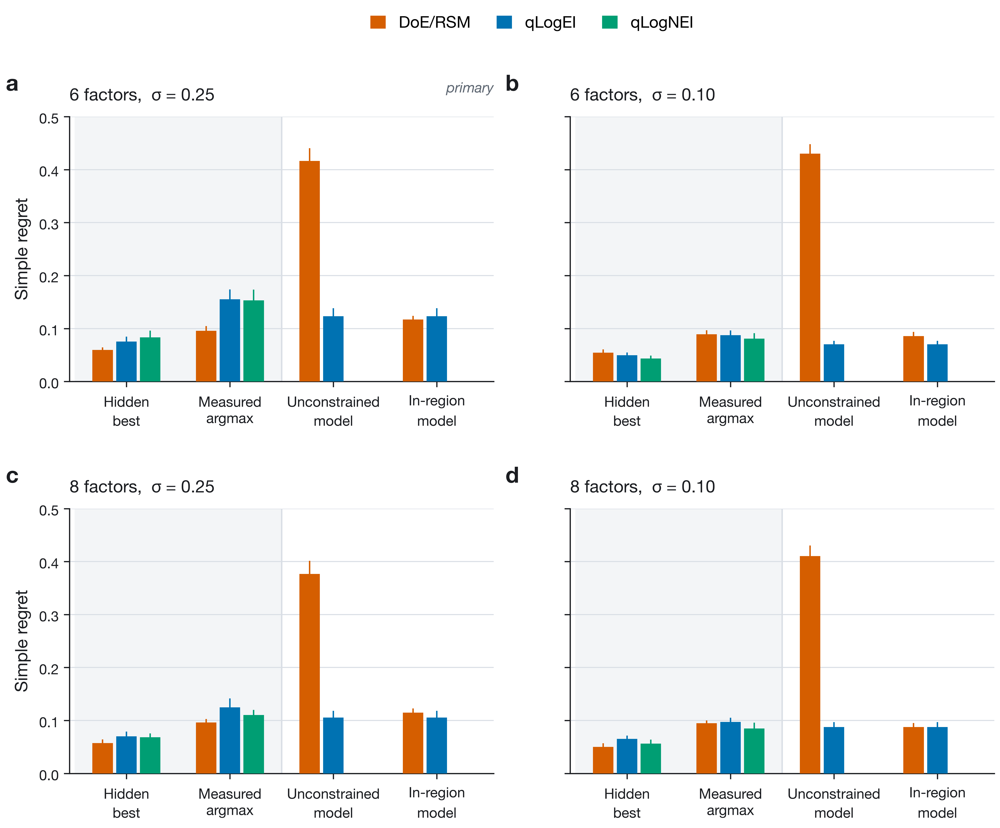
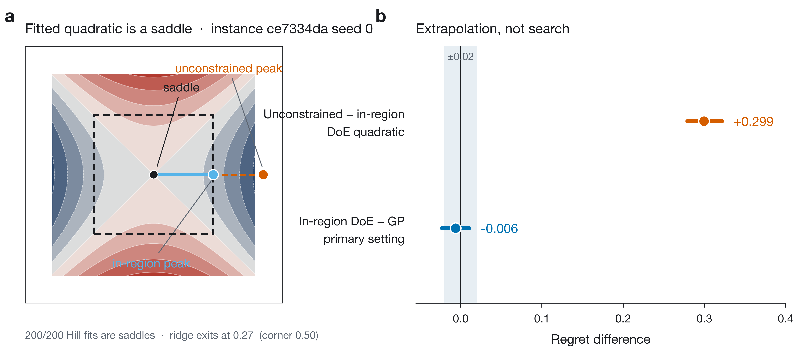
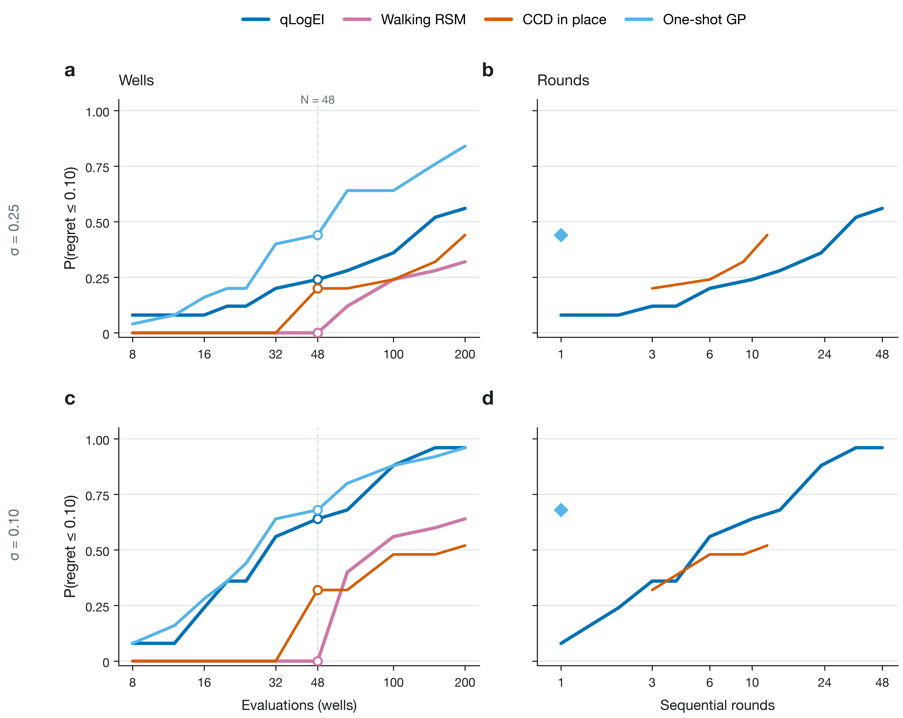

# What this project is

This file teaches the project from zero. It is not a journal manuscript. A submission draft is `docs/MANUSCRIPT.md`. Locked numbers here are the ones a paper may use. Long tables: `docs/SUPPLEMENT.md`. Campaign notes: `docs/RESULTS.md`. Figures: `python scripts/make_paper_figures.py`. JSON filenames under **Methods** are where those numbers were stored, not names of methods.

If you read only one page, read **The result in one page**, then **How a campaign is scored**.

---

## The result in one page

**Question.** Given the same experimental budget, does Bayesian optimization (BO) beat a classical design-of-experiments / response-surface (DoE/RSM) pipeline for picking a culture-media recipe?

**Setting.** No cells were grown. The “recipes” are points in a synthetic six- or eight-factor landscape whose shape is *inspired by* published extracellular-matrix (ECM) dose–response curves, not fitted to them. Each campaign may evaluate 48 conditions. Noise is added to the observations. After the campaign, one condition is nominated. We score that nomination by how far its *true* quality is from the global best (simple regret; lower is better).

**The finding.** There is no single winner. The ranking reverses when you change only the rule that turns 48 noisy measurements into one nominated recipe. That rule is the **terminal decision**. It is the object of the study.

| Terminal rule | What it asks | Primary-cell verdict (6 factors, higher noise, 48 wells) |
|---|---|---|
| Keep the well with the largest noisy measurement | Identification under assay noise | DoE/RSM better by **0.0595** vs qLogEI and **0.0574** vs qLogNEI |
| Keep the truly best well already visited | Search quality (not available in a lab) | DoE/RSM better by only **0.0158**; **~73%** of the 0.0595 was identification |
| Maximize the fitted quadratic over the whole box | Naïve model recommendation | BO better by **0.27–0.36**; all 200 quadratics are **saddles** |
| Maximize the model only where data exist | Fair model recommendation | **Inconclusive** (−0.0063; neither different nor equivalent within 0.02) |

Equal well counts are also not equal time: DoE/RSM uses **3 plate rounds**, batch BO uses **10**, a one-shot Latin hypercube uses **1**. On this smooth Hill surface a one-shot GP often hits the target in one round; on a multimodal benchmark it does not.

**Local BO (TuRBO-1) does not change the noisy-argmax story.** Forcing qLogNEI to sample only inside an adaptive trust region left measured-argmax regret at **0.1538**, statistically the same as unconstrained qLogNEI (**0.1532**; difference **+0.0006** [−0.0205, +0.0206]). DoE/RSM still leads by **0.0580** [0.0390, 0.0768]. Forty-eight unique wells, zero restarts, no TR collapse. Locally constrained sequential search is not walking RSM, and it does not fix identification.

**What this is not.** A wet-lab validation. A claim that “BO is better” or “DoE is better.” A reproduction of Hall, Lin and Ogle’s endothelial data.

---

## Why the project exists

Laboratories optimizing media, coatings, or similar mixtures cannot test every combination. Five levels of six ingredients already means 15,625 conditions. They therefore run a *small* campaign and must still choose **one** recipe to keep.

Two standard tools get compared in the literature, and the conclusions disagree:

- **Response-surface methodology (RSM)** after a designed experiment (DoE): a planned screen, then a structured second-order design (here a face-centered central composite design, CCD), then a quadratic fit. Classically one reads the local geometry (canonical analysis, ridge analysis) and, if needed, walks uphill (steepest ascent) and plants a new design. Box & Wilson 1951; Myers, Montgomery & Anderson-Cook.
- **Bayesian optimization (BO):** fit a probabilistic surrogate, usually a Gaussian process (GP). Choose the next experiments with an acquisition function that trades exploration against exploitation. Here the batch acquisitions are **qLogEI** and noise-aware **qLogNEI** in BoTorch. The prefix *q* means the batch is chosen by a Monte Carlo acquisition.

Published bioprocess papers do not all answer the same question. Some compare BO to a *predicted* full DoE size (Narayanan et al.). Some match experiment *count* but not the final-pick rule, the number of plate cycles, or which factors each arm is allowed to keep (Rummukainen, Lapierre, Ndahiro). This project holds the visited wells fixed and varies the **pick**, then counts **wells** and **rounds** separately, so those pieces cannot be mixed by accident.

**Collaborators.** Alan and Joseph. The science below is locked to committed JSON; do not invent replacements.

---

## Words used throughout

**Recipe / condition / well.** One point in the factor box: a complete set of ingredient levels. Evaluating it consumes one well (one experimental unit).

**Landscape / instance.** One synthetic response surface, drawn at random from a family. We use 25 landscapes. Each algorithm is run with two random seeds on each landscape; those two runs are averaged so the inferential sample size is 25, not 50.

**Latent response \(f(x)\).** The noiseless true quality of recipe \(x\), scaled so the global best is 1. Only the computer knows this.

**Observation \(y(x) = f(x) + \varepsilon\).** What a laboratory would see. \(\sigma \in \{0.25, 0.10\}\) is the observation-noise standard deviation. It is a simulation knob, **not** an assay coefficient of variation.

**Simple regret.** \(R = 1 - f(x^*)\), where \(x^*\) is the recipe nominated at the end. \(R = 0.10\) means the nominated recipe has true quality 0.90. **Lower is better.**

**Contrast.** Always DoE/RSM minus BO on the same 25 landscapes. **Negative: DoE/RSM better. Positive: BO better.**

**Primary setting.** Six factors, \(\sigma = 0.25\), \(N = 48\) wells. Locked before the main grid at commit `d289e7d`. The two confirmatory contrasts are measured-value argmax and in-region recommendation, DoE/RSM vs the named BO method.

**Exploratory.** The other three factor–noise cells, extra arms, and robustness benchmarks, unless stated otherwise.

**Terminal rule.** The function that maps a finished campaign (the list of \(x\), \(y\)) to one \(x^*\). Changing it does not re-run the optimizer; it re-reads the same wells.

**Search vs identification vs recommendation.**

- Search: did the campaign *visit* a good recipe?
- Identification: given the noisy \(y\) values, did we *recognize* the best visited recipe?
- Recommendation: did a fitted model nominate a (possibly untested) recipe that is actually good?

**Saddle.** A fitted quadratic that curves up in some directions and down in others. It has no stable interior maximum. Maximizing it over the whole factor box drives the suggestion to a far boundary. Classical RSM treats that geometry as a signal to follow a ridge or steepest-ascent path and relocate, not as “the optimum is the box corner.”

**In-region.** Maximize the model only inside the region the campaign actually sampled.

**SESOI / TOST.** Smallest effect size of interest = 0.02 regret. Two one-sided tests. Equivalence only if both reject. An interval covering 0 is **not** equivalence; it is “not shown to differ.” If neither difference nor equivalence is shown, the call is **inconclusive**.

**Wilcoxon vs bootstrap.** Wilcoxon signed-rank on the 25 paired landscape differences governs the yes/no. The bootstrap interval says how large. If they disagree, both are reported; Wilcoxon still governs the declaration.

**Round.** One plate cycle: prepare, incubate, read, then (if sequential) choose the next batch. Incomplete batches are charged as a full plate.

---

## What was actually simulated

### The landscape

Each landscape is a **biphasic Hill-type** function of \(d\) coded factors in \([0,1]^d\): each factor rises, peaks, then falls (high dose is inhibitory), so the true optimum is *inside* the box, not at a corner. Factor-level curves are peak-normalized to 1. A modest interaction structure is added. Exact formula and parameter draws: `docs/METHODS.md` and `docs/SUPPLEMENT.md`.

Hall, Lin and Ogle (*Sci. Rep.* 2025) used six ECM proteins and a screen that kept four. That **structure** is copied: \(d = 6\) with a 6-to-4 screen on the classical arm; \(d = 8\) adds two inert (nuisance) coordinates. The numerical surface is **not** a fit to their endothelial measurements. Digitized medians from their figures exist in the repo and were used only in underpowered auxiliary analyses (replay was null; the assay could not resolve small effects).

Near-separability of the Hill family is a stated limitation (additive share ≈ 0.93). That is why Levy, Rosenbrock, and Hartmann6 were also run.

### The 48-well campaigns

| Arm | What it does | Rounds at 48 wells |
|---|---|---|
| DoE/RSM | 20-run screen → keep 4 factors → 27-run face-centered CCD → 1 confirmation well | 3 |
| qLogEI | Sobol opening of \(2d+2\) points, then batches of 4 chosen by log expected improvement | 10 |
| qLogNEI | Same schedule; noise-aware acquisition | 10 |
| One-shot GP | Latin-hypercube design, one GP fit, no adaptation | 1 |
| Random | Uniform random 48 points | 1 |

The 48-well DoE pipeline has **no leftover budget** for a full steepest-ascent relocation. For long-run cost (cap 200 wells) a separate sequential RSM arm walks the path, relocates the center, and plants a new CCD (`doe_ascent`, rule `path_argmax`, locked at `fd842ac`). Repeating the original CCD in place (`doe_repeat`) is a **control**, not textbook sequential RSM.

Other control procedures exist in the supplement (Latin hypercube, Sobol, coordinate descent). They are not the confirmatory pair.

### Four cells

| | \(\sigma = 0.25\) (higher noise) | \(\sigma = 0.10\) (lower noise) |
|---|---|---|
| 6 factors | **Primary** | Exploratory |
| 8 factors | Exploratory | Exploratory |

---

## How a campaign is scored

Imagine 48 noisy readings on the bench. You must ship one recipe. These are the rules we applied to **the same 48 wells**.

1. **Hidden tested-best.** Among visited wells, pick the one with largest \(f(x)\). A laboratory cannot do this. It measures search only.
2. **Measured-response argmax.** Pick the well with largest \(y(x)\); score it at \(f\). This is “carry forward the best assay reading.”
3. **Unconstrained model recommendation.** Fit the quadratic (DoE) or GP (BO) and maximize over the entire factor box, including untested corners.
4. **In-region recommendation.** Same models, maximum restricted to the explored region.
5. **Full replication.** Re-measure all 48 and average the two readings.
6. **Top-three confirmation.** Re-measure the three largest original \(y\); decide from the *new* reading only (original discarded).
7. **Posterior-mean selection.** Among tested wells, pick the largest GP posterior mean.

An eighth rule, **average original + confirmation on the top-3 shortlist**, was specified and **not run**: replaying stored BO visit logs failed a \(10^{-12}\) reproducibility gate after an acquisition-optimizer retry. Fully sequential BO (\(q = 1\), one well per round) is unrun for the same reason. Neither may be used as a result.

**Unconstrained vs in-region.** Maximizing a saddle over the whole factor box is a diagnostic of unsupported extrapolation, not the recipe a careful RSM practitioner would ship. In-region recommendation is the comparison that resembles classical practice. Both numbers are always kept; they answer different questions. DoE measured-argmax at the primary setting is **0.0958**. Hidden tested-best for the same campaigns is **0.0597** (Table 2). Those are two different picks, not two names for one column.

---

## How to read a results table

| You see | It means |
|---|---|
| Mean R = 0.10 | Nominated recipe has true quality 0.90 |
| DoE − BO = −0.0595 | On average DoE’s regret is 0.0595 *lower* (DoE better) |
| [−0.0797, −0.0375] | 95% bootstrap interval for that mean difference, over 25 landscapes |
| Interval includes 0 | No directional difference shown at n = 25. **Not** “the methods are the same” |
| Equivalent within 0.02 | Both TOST one-sided tests rejected at SESOI = 0.02 |
| Inconclusive | Neither a difference nor equivalence was shown |
| Wilcoxon \(p\) | Consistency of sign across landscapes, not the size of the gap |

Primary confirmatory contrasts are **not** Holm-adjusted. Holm is for families of many arms or many arrival targets.

---

## What we found

### The ranking flips when only the pick changes

**Figure 1.** Same 48-well campaigns; four terminal rules; lower is better. Bars are landscape means (n = 25) with 95% bootstrap intervals. qLogNEI has no stored model recommendation (empty slots). The GP in-region bar equals the unconstrained GP bar because the stored peak already lies inside the sampled region. Rank reversal in **3 of 4** settings; six factors at \(\sigma = 0.10\) does not reverse.

Read left to right in each panel: hidden best (search) is similar and fairly good for all arms; measured argmax (noisy pick) opens a gap at high noise; unconstrained model explodes DoE regret; in-region brings DoE back next to the GP.

### Carry forward the largest measurement

**Table 1.** Mean simple regret when the tested well with the highest measured response is selected.

| Setting | DoE/RSM | qLogEI | qLogNEI | Random | DoE/RSM − qLogEI | DoE/RSM − qLogNEI |
|---|---:|---:|---:|---:|---:|---:|
| 6 factors, \(\sigma=0.25\) (primary) | **0.0958** | 0.1553 | 0.1532 | 0.2216 | **−0.0595** [−0.0797, −0.0375] | **−0.0574** [−0.0776, −0.0376] |
| 6 factors, \(\sigma=0.10\) | 0.0892 | 0.0874 | **0.0808** | 0.1693 | +0.0018 [−0.0086, +0.0117] | +0.0084 [−0.0059, +0.0214] |
| 8 factors, \(\sigma=0.25\) | **0.0963** | 0.1247 | 0.1105 | 0.1712 | **−0.0284** [−0.0447, −0.0139] | **−0.0142** [−0.0251, −0.0036] |
| 8 factors, \(\sigma=0.10\) | 0.0948 | 0.0972 | **0.0849** | 0.1272 | −0.0024 [−0.0095, +0.0053] | +0.0100 [−0.0010, +0.0207] |

At higher noise, the planned DoE geometry (center replicates, space-filling CCD) is easier to read with a single noisy argmax than BO’s cluster of near-ties. At lower noise, DoE vs qLogEI meets equivalence within 0.02. BO is still useful search: random − qLogEI at the primary setting is **+0.0664** [+0.0418, +0.0914].

### Most of the 0.0595 is identification, not search

Rescore the same wells using hidden tested-best.

**Table 2.** Hidden tested-best regret and the share of the measured-value contrast that is identification.

| Setting | DoE/RSM | qLogEI | Hidden contrast | Measured contrast | Identification share |
|---|---:|---:|---:|---:|---:|
| 6 factors, \(\sigma=0.25\) (primary) | 0.0597 | 0.0755 | **−0.0158** [−0.0257, −0.0062] | **−0.0595** | **73%** |
| 6 factors, \(\sigma=0.10\) | 0.0544 | 0.0496 | +0.0048 [−0.0030, +0.0131] | +0.0018 | — |
| 8 factors, \(\sigma=0.25\) | 0.0575 | 0.0702 | −0.0127 [−0.0251, −0.0008] | **−0.0284** | **55%** |
| 8 factors, \(\sigma=0.10\) | 0.0500 | 0.0653 | −0.0153 [−0.0254, −0.0059] | −0.0024 | — |

Share is reported only where the measured contrast is directional. At eight factors and low noise, the hidden contrast against **qLogNEI** is null, so that row is not a general DoE search advantage.

How often the noisy winner *is* the true best visited well, primary cell: qLogEI **8%**, qLogNEI **22%**, DoE/RSM **12%**. qLogNEI helps identification relative to qLogEI; it does not remove the high-noise measured-argmax disadvantage.

### Unconstrained quadratic maximization is not classical RSM

Fit the same DoE quadratic, then maximize it two ways.

- Over the whole box, BO’s GP beats the quadratic by **+0.2931, +0.3598, +0.2710, +0.3228** in the four cells.
- **200/200** Hill quadratic fits are saddles. Unconstrained minus in-region DoE regret at the primary setting: **+0.2995** [+0.2790, +0.3228]. The ridge path leaves the designed region at median coded radius ≈ **0.27** (a box corner is 0.50).
- Almost all of the swing from “DoE wins” to “BO wins” is the DoE arm’s locator, not BO getting much better (DoE regret jumps ~+0.32; BO’s model pick is slightly *better* than its measured argmax).

**Table 3.** In-region model recommendation (the comparison that resembles ridge-constrained practice).

| Setting | Quadratic | GP | DoE/RSM − GP | Interpretation |
|---|---:|---:|---:|---|
| 6 factors, \(\sigma=0.25\) (primary) | 0.1169 | 0.1232 | −0.0063 [−0.0233, +0.0107] | **Inconclusive** (SESOI 0.02; MDE ≈ 0.027) |
| 6 factors, \(\sigma=0.10\) | 0.0856 | 0.0703 | +0.0153 [+0.0042, +0.0269] | GP favored; exploratory |
| 8 factors, \(\sigma=0.25\) | 0.1148 | 0.1056 | +0.0091 [−0.0057, +0.0243] | Inconclusive |
| 8 factors, \(\sigma=0.10\) | 0.0877 | 0.0876 | +0.0001 [−0.0118, +0.0115] | Equivalent within 0.02 |

The GP peak already lies in the sampled region in this implementation, so unconstrained GP = in-region GP. Posterior-mean and GP-optimum rules are **conditional on miscalibration**: nominal 95% *latent* intervals cover as little as **76.4%**; intervals that include observation noise cover about **90–92%**.

**Figure 3.** (A) Canonical-plane contour of the fitted quadratic for instance `ce7334da318bc5e5` seed 0 (most negative vs most positive Hessian eigenvalue; box is the stored stage-2 circumradius 0.50). (B) Primary setting: unconstrained − in-region DoE = +0.2995; in-region DoE − GP = −0.0063. Grey band ±0.02.

A design × surrogate factorial (same wells, swap the model) shows **both** sampling geometry and surrogate class matter; it is not “only the GP” or “only the CCD.” Four-factor refits remove a dimension confound. Details: `docs/SUPPLEMENT.md`.

### Changing the final pick on the same wells

**Table 4.** Primary-setting DoE/RSM − qLogEI under other terminal rules.

| Terminal rule | Extra wells | DoE/RSM − qLogEI |
|---|---:|---:|
| Measured-response argmax | 0 | **−0.0595** [−0.0797, −0.0375] |
| Re-measure every well and average | +48 | −0.0262 [−0.0446, −0.0079] |
| Re-measure the top 3; decide by the new reading only | +3 | −0.0009 [−0.0263, +0.0253] |
| Highest posterior mean among tested wells | 0 | −0.0227 [−0.0438, −0.0022] |

Top-three confirmation-alone is **inconclusive** (MDE ≈ 0.042), not a tie. It also made DoE *worse* in absolute regret (0.0958 → 0.1437) because it threw away the original reading. Averaging original + confirmation on that shortlist is the natural lab variant and is **unrun**. Posterior mean: bootstrap interval excludes 0, Wilcoxon \(P = 0.1135\) → **not declared different**.

### Wells are not rounds

At 48 wells: DoE/RSM **3** rounds, qLogEI/qLogNEI **10**, one-shot **1**. If incubation and decision time dominate, that is a different contest than “48 pipetting events.”

Campaigns were extended to a **200-well cap** at six factors. Arrival means: fraction of 25 landscapes that have reached a regret target by budget \(N\). Failures stay in the denominator (a method that never arrives must not look fast by ignoring those landscapes).

**Figure 2.** \(P(\text{regret} \le 0.10)\) under measured-value argmax. Walking RSM is plotted against wells only (its checkpoints are not on qLogEI’s round grid). The one-shot GP marker on rounds panels is the 48-well Latin hypercube (one round).

**Table 5.** Landscapes reaching the target (measured-value argmax, six factors, cap 200).

| Noise | Target regret | Relocating RSM | qLogEI | CCD in place | One-shot GP | Multiplicity-adjusted \(P\) |
|---|---:|---:|---:|---:|---:|---:|
| Higher | 0.15 | 21/25 | 21/25 | 23/25 | 25/25 | 1.00 |
| Higher | 0.10 | 8/25 | 14/25 | 11/25 | 21/25 | 0.88 |
| Lower | 0.15 | 24/25 | 25/25 | 23/25 | 25/25 | 1.00 |
| Lower | **0.10** | **16/25** | **24/25** | **13/25** | **24/25** | **0.070** |
| Lower | 0.05 | 6/25 | 18/25 | 7/25 | 16/25 | 0.042 |

**Two corrections are in play and the table's column reports the narrower one.** No rule-A arrival contrast survives Holm over the **full family of 26**. Within the **rule-A sub-family of ten**, which is what the \(P\) column above reports, exactly one cell survives: lower noise at the tightest target 0.05, qLogEI **18/25** against relocating RSM **6/25** (exact McNemar 0.0042, adjusted **0.042** over ten, but **0.109** over twenty-six). Lower noise at target 0.10 fails under either correction (0.0078 exact; 0.070 over ten, 0.094 over twenty-six). So the only arrival claim that survives any correction is narrow -- one cell, at the lower noise level and the tightest target -- and it does not survive the full family. Do not quote it as a general efficiency result; at looser targets every arm arrives, random included. At lower noise and target 0.10, relocating RSM is **16/25**; **13/25** is CCD repeated in place. Those are different arms. Where paired well-count ratios exist, they lie in **0.73–1.02**: no general BO well-count saving over relocating RSM. Relocating RSM moved on average **3.4** times per campaign at higher noise.

Unconstrained *model-recommendation* arrival still favors BO, but part of that is **when a recommendation first exists** (relocating RSM cannot issue one before ~53 wells). Do not call those pure search-efficiency ratios.

### One-shot GP vs sequential BO

On **Hill**, \(\sigma = 0.25\), model recommendation, target 0.10: one-shot GP reached the target on **24.4/25** landscapes (mean over five Latin-hypercube draws) in **one round**. Ten-round qLogEI: **16/25**. The surface is smooth enough that filling the box once and fitting a GP is round-cheap.

On **Hartmann6** (multimodal), one-shot GP **loses** to sequential BO. Removing the 6-to-4 screen on Hartmann6 made DoE/RSM worse by ≈ **0.207** and increased BO’s lead 1.55- to 1.78-fold: screening concentrated the classical design; it did not handicap it. An unscreened six-factor quadratic has 28 coefficients; at eight factors a full quadratic has 45, which 48 wells cannot support.

**Levy** and **Rosenbrock** reproduce the qualitative split (measured argmax vs unconstrained model). **Ackley** is excluded: the CCD evaluates the box center by construction, which *is* Ackley’s optimum, so DoE would win by geometry of the test function, not by the method.

### Trust-region BO (Q62)

TuRBO-1 (Eriksson et al. 2019; BoTorch defaults; restart **keeps** history) is a **sampling box**, not a new pick. Primary cell, *N*=48, measured argmax (`results/q62-turbo.json`):

| Arm | Mean regret | vs TuRBO (DoE − TuRBO or TuRBO − qLogNEI) |
|---|---|---|
| 48-well DoE/RSM | 0.0958 | **−0.0580** [−0.0768, −0.0390] |
| Unconstrained qLogNEI | 0.1532 | TuRBO − qLogNEI **+0.0006** [−0.0205, +0.0206] |
| TuRBO-1 qLogNEI | **0.1538** | identification gap **0.0704**; GP rec. (box / TR) 0.1288 / 0.1385 |

At σ=0.10, TuRBO **0.0736** vs DoE **0.0892** (DoE − TuRBO **+0.0156** [+0.0041, +0.0274]) and vs unconstrained qLogNEI **0.0808** (inconclusive). Collapse rate 0; every 48-well campaign visited 48 distinct wells.

**N=200 arrival** (`results/q62-turbo-n200.json`), measured argmax, τ=0.10, both seeds must hit. Do **not** subtract 48-well DoE from 200-well TuRBO regret.

| σ | TuRBO hits | Q56 `doe_ascent` | Q56 qLogEI | Mean unique wells | Mean restarts |
|---|---|---|---|---|---|
| 0.25 | **11/25** | 8/25 | 14/25 | 199.6 | 2.0 |
| 0.10 | **25/25** | 16/25 | 24/25 | 199.1 | 1.9 |

Same pattern as the rest of the cost chapter: at the noisy primary cell TuRBO does not open a well-count saving versus relocating RSM (11 vs 8, and unconstrained qLogEI was already 14). At lower noise everyone eventually arrives; that is not a methods win.

Language for the paper: **locally constrained sequential search**. Do not write “TuRBO is RSM.”

---

## Objections already measured

These are the main “you cheated” lines, and the answers on disk.

| Objection | Answer |
|---|---|
| BO was a bad implementation | Additive kernel doubled held-out \(R^2\) and did not move regret. Lengthscale prior tests did not rescue BO. Acquisition optimizer failed in 4/3400 (0.118%), below a 1% pre-set threshold. Opening-design size: no rescue at the primary cell. |
| DoE was given a bad design | Inside its own region the CCD is far more D-efficient than the adaptive cloud. It fails *despite* good local geometry when you box-max a saddle. |
| Lucky Latin hypercube | One LHS draw was unusually good; design-averaging does not remove qLogEI vs space-filling as a phenomenon. See supplement. |
| Hill is too additive / made-up | Stated (≈0.93 additive). Reversal of unconstrained vs measured scoring reproduces on Levy and Rosenbrock. Hartmann6 is a different geometry (BO wins all rules). |
| Hall/Ogle replay shows BO is no better than random | Replay was **null**; the digitized assay’s MDE was huge. That is a power statement, not a BO-vs-random statement. |
| GP uncertainty is trustworthy | It is not, for latent \(f\). Worst empirical 95% coverage 0.764. |
| Unconstrained BO is unfair because it searches the whole box | TuRBO-1 still matches unconstrained qLogNEI at the primary cell. The DoE lead is not “BO wandered.” |

---

## What must not be claimed

- “BO beats RSM” or the reverse, as a method-level fact.
- In-region primary is a **tie** (it is inconclusive; MDE 0.027 > SESOI 0.02).
- Top-three confirmation is **equivalence**.
- Relocating RSM loses to qLogEI on arrival after Holm.
- Hall/Ogle’s cells were reproduced, or this is wet-lab evidence.
- Averaged top-three confirmation, or \(q = 1\) BO, were run.
- TuRBO is the same algorithm as walking RSM.
- A smoke campaign (one landscape) is a locked contrast.
- Unconstrained saddle-max is what classical RSM would ship as the optimum.

---

## Methods (how the numbers were made)

**Units.** 25 landscapes × 2 seeds; average seeds first; n = 25. Primary lock: `d289e7d`. Relocating RSM: `fd842ac`.

**DoE/RSM, 48 wells.** 20-run screen, 4 retained factors on Hill, 27-run face-centered CCD, 1 confirmation. Second-order polynomial; canonical classification of the stationary point.

**BO.** qLogEI (BoTorch 0.18.1); qLogNEI co-primary. Sobol \(2d+2\), then \(q = 4\). Optional Q62 arm: same acquisition inside a TuRBO-1 trust region (`length_init=0.8`, `length_min=0.5^7`, `length_max=1.6`); noisy incumbent = posterior mean at visited wells; restart keeps all wells.

**Inference.** Paired bootstrap 95% intervals. TOST at 0.02. Wilcoxon for yes/no. Holm on multi-arm and multi-target arrival families. Identification share: measured-value contrast minus hidden-tested-best contrast (formula in `docs/SUPPLEMENT.md`). Arrival: \(P(T \le N)\) to a regret target, cap 200.

**Software.** Python 3.11, BoTorch 0.18.1, GPyTorch 1.15.2, PyTorch 2.13.0.

**Source JSON.**

| What | File |
|---|---|
| 48-well grid | `results/e2-grid.json`, `results/e2-doe-d8.json` |
| Design × surrogate | `results/q34-factorial.json` |
| Constrained RSM, saddles | `results/q35-constrained-rsm.json` |
| Cost to target | `results/q52-budget-to-target.json` |
| Relocating RSM | `results/q56-doe-ascent.json` |
| Search vs identification | `results/q55-oracle-best.json`, `results/q57-search-vs-id.json` |
| Confirmation / posterior mean | `results/q58-selection-sensitivity.json` |
| TuRBO-1 (add-on cell) | `results/q62-turbo.json`, `results/q62-turbo-n200.json` |
| One-shot GP, five draws | `results/q54-hill-spread-gp-draws.json` |
| Hartmann6, no screen | `results/q59-hartmann-no-screen.json` |
| TOST | `results/tost-contrasts.json` |
| Figures | `docs/figures/` |
| Audit trail | `docs/RESULTS.md` |

---

## Where to look in the repository

| Need | Place |
|---|---|
| This teaching file | `docs/RESEARCH-SUMMARY.md` |
| Extra tables, round reconstruction, control-arm means | `docs/SUPPLEMENT.md` |
| Chronological campaign notes | `docs/RESULTS.md` |
| Code | `src/boec/` |
| Figure generator | `src/boec/paper_figures.py`, `scripts/make_paper_figures.py` |
| Interactive lab plots (not journal) | `results/figures/` |

If another document disagrees with a table in this file, use this file.

---

## What each JSON file is

Filenames such as `e2-grid.json` are storage tags, not method names. This map is only for finding the run behind a table.

### Campaigns (new wells)

**Sanity check.** BO vs random on standard toy functions, not the Hill media landscape. If BO cannot beat random there, the implementation is broken. It could.

**Main 48-well head-to-head (`results/e2-grid.json`).** Twenty-five Hill landscapes, two seeds, 48 evaluations. Classical pipeline versus qLogEI. Nominate the well with the largest noisy measurement; score its true quality. Table 1 and most of Figure 1. Eight-factor DoE: `results/e2-doe-d8.json`.

**GP calibration.** After fitting, check whether 95% posterior intervals contain the true noiseless quality about 95% of the time. They do not. Worst coverage about 76%. Claims that use the GP posterior mean, or a GP “optimum,” therefore use a miscalibrated surrogate.

**Other surfaces.** Levy and Rosenbrock still reverse ranking when switching from measured argmax to unconstrained quadratic max. On Hartmann6, BO is ahead under every pick used. Ackley is discarded: the CCD always tests the box center, which *is* Ackley’s optimum.

**Past 48 wells (`results/q52-budget-to-target.json`).** Same six-factor landscapes, cap 200 evaluations. Fraction of landscapes that have already reached a quality target. Figure 2 includes qLogEI, CCD repeated in place, and one-shot GP.

**Relocating RSM (`results/q56-doe-ascent.json`).** Walk uphill, recenter, plant a new CCD. Table 5’s relocating-RSM column (16/25 at lower noise, target 0.10). CCD in place (13/25) is the no-move control. Stopping rule on the path: `path_argmax` (commit `fd842ac`).

**One-shot GP, five layouts (`results/q54-hill-spread-gp-draws.json`).** Average 24.4 of 25 landscapes at the stated Hill target. Sequential updates help on Hartmann6; they are less necessary on a smooth Hill surface.

**Hartmann6 without screening (`results/q59-hartmann-no-screen.json`).** DoE got worse without the 6-to-4 screen, so the screen concentrated the design on active factors rather than handing the win to BO.

**Q62 TuRBO-1 (`results/q62-turbo.json`, `results/q62-turbo-n200.json`).** Sequential qLogNEI may only propose inside an adaptive trust region (BoTorch TuRBO-1 defaults; restart **keeps** history). This is a **sampling constraint**, not a new terminal rule and not isomorphic to relocating RSM. Locked 48-well: 25 landscapes × 2 seeds, d = 6, `"smoke": false`. Primary measured-argmax: TuRBO 0.1538 vs qLogNEI 0.1532 vs DoE 0.0958. *N*=200 arrival at τ=0.10: 11/25 (σ=0.25) and 25/25 (σ=0.10) vs Q56 `doe_ascent` 8/25 and 16/25. Figure 4 is the 48-well bar chart.

**One well per round.** Specified and not run: replay of stored BO visit logs failed a \(10^{-12}\) gate.

### Re-readings (same wells, different pick)

**Design vs surrogate (`results/q34-factorial.json`).** Fit a quadratic on BO’s wells and a GP on DoE’s wells. Both sampling geometry and model class matter. Figure 1’s GP model bars come from this file. A follow-up refits four-factor polynomials on both designs so “polynomial vs GP” is not mixed with “4D vs 6D.”

**Same quadratic, three peaks (`results/q35-constrained-rsm.json`).** Best tested well; maximum anywhere in the box; maximum only in the sampled region. The unconstrained BO “win” is a change of reading. All 200 fits are saddles. Table 3 and Figure 3.

**Search vs identification (`results/q55-oracle-best.json`, `results/q57-search-vs-id.json`).** Hidden best visited well versus largest noisy reading. Table 2: about 73% of the primary 0.0595 lead is identification. qLogNEI is included so a qLogEI-only search result is not quoted as “DoE versus BO in general.”

**Confirmation and posterior mean (`results/q58-selection-sensitivity.json`).** Table 4. Averaging original plus confirmation on the top-3 shortlist was specified and not run (same replay blocker as one-well-per-round BO).

---

## Paper outline (if one is written)

Not prose. Order of argument only.

**Through-line.** A matched well count is not a matched comparison. Change only the terminal rule; the ranking moves.

**Abstract.** Problem → design → measured −0.0595 and 73% identification → unconstrained +0.27–0.36 and 200 saddles → in-region inconclusive → confirmation inconclusive → TuRBO does not close the noisy-argmax gap → one-shot vs ten-round on Hill → prespecify pick, noise, extrapolation, confirmation, batching, cost unit.

**Introduction.** Cost of grids → RSM vs BO toolkits, including “saddle ⇒ relocate, do not box-max” → literature terminal rules differ → isolate the terminal rule → this study is synthetic Hill, Hall/Ogle structure only.

**Results, this order.** Figure 1 (flip) → Table 1 (noisy argmax) → Table 2 (identification) → Figure 3 and Table 3 (saddle / in-region) → Table 4 (confirmation) → Figure 4 (TuRBO vs full-box qLogNEI) → Figure 2 and Table 5 (wells vs rounds) → one-shot vs Hartmann.

**Discussion.** Three terminal rules; unconstrained ≠ classical RSM; local BO ≠ walking RSM; literature can disagree without contradiction; choose method by constraint (map / rounds / multimodality); limitations (synthetic, n = 25, GP coverage, averaged top-3 confirmation and one-well-per-round BO unrun, no wet lab).

**Methods.** Copy from **Methods** above.

**Do not claim.** The list in that section.

### Citations to keep

1. Box & Wilson, *J. R. Stat. Soc. B* **13**, 1–45 (1951).
2. Myers, Montgomery & Anderson-Cook, *Response Surface Methodology*, 4th edn (Wiley, 2016).
3. Močkus, IFIP (1975).
4. Jones, Schonlau & Welch, *J. Glob. Optim.* **13**, 455–492 (1998).
5. Frazier, arXiv:1807.02811 (2018).
6. Gisperg et al., *Biotechnol. Bioeng.* **122**, 1313–1325 (2025).
7. Hall, Lin & Ogle, *Sci. Rep.* **15**, 24479 (2025).
8. Rummukainen et al., *Heliyon* **10**, e24484 (2024).
9. Lapierre et al., *J. Chem. Technol. Biotechnol.* **100**, 1571–1583 (2025).
10. Ndahiro et al., *iScience* **28**, 112944 (2025).
11. Narayanan et al., *Nat. Commun.* **16**, 6055 (2025).
12. Eriksson et al., *NeurIPS* (2019). TuRBO.
