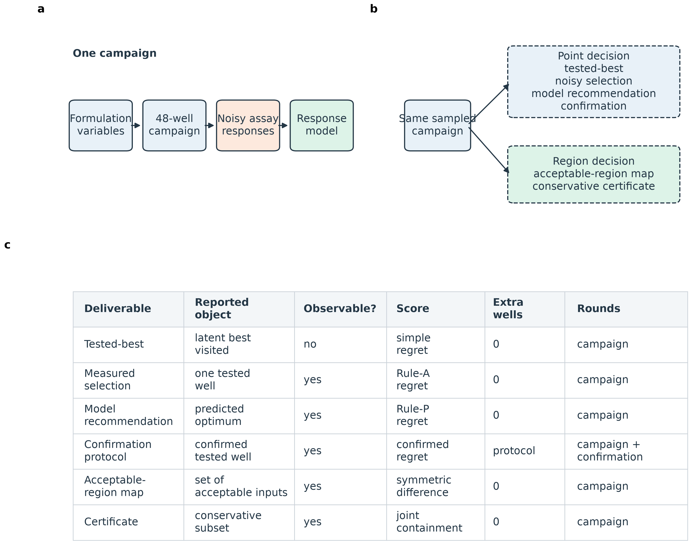
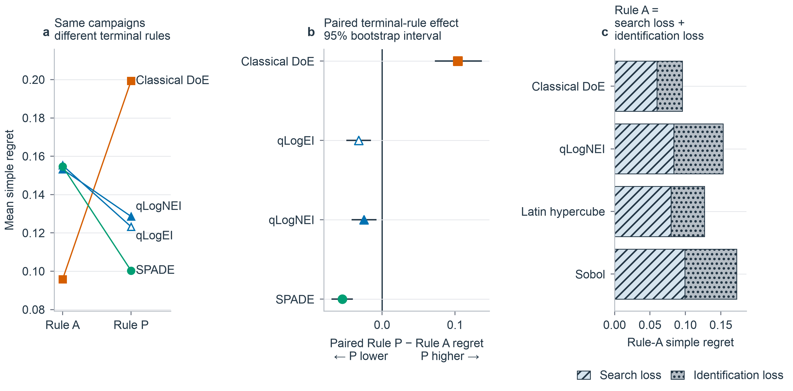
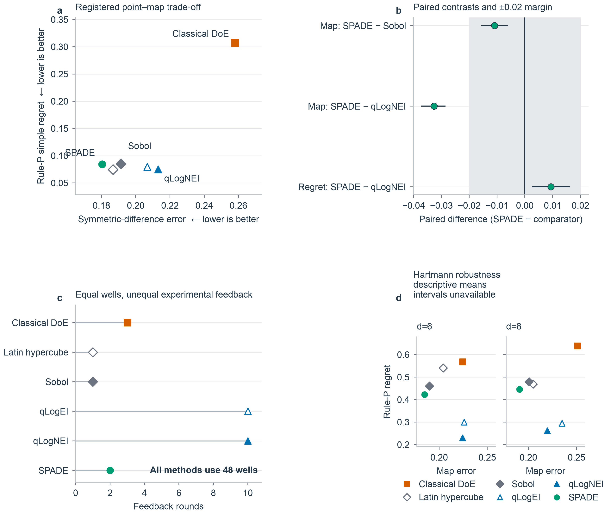
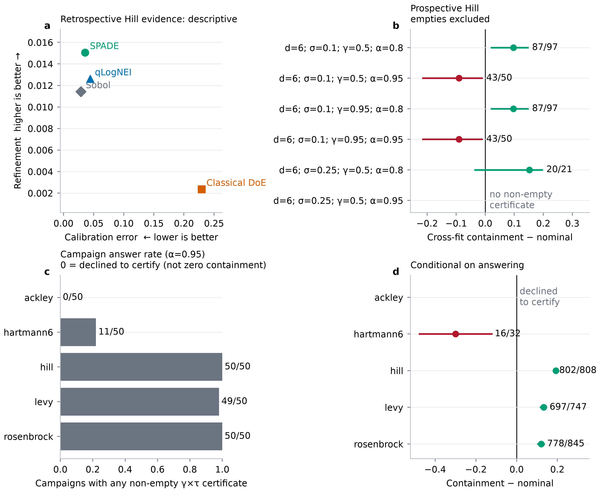

# Point and region objectives reverse method rankings under matched experimental budgets: A preregistered synthetic benchmark of SPADE, Bayesian optimization, and response-surface methods

**Short title:** Point versus region experimental design

**Authors:** [AUTHOR ORDER TO BE CONFIRMED]

**Affiliations:** [AFFILIATIONS TO BE CONFIRMED]

**Corresponding author:** [NAME, ADDRESS, AND EMAIL TO BE CONFIRMED]

## Abstract

When experimental handoff requires an operating region rather than one recipe, ranking design strategies by a single nominated point can mislead. We report a preregistered computer experiment that compares region-first and point-first workflows under matched 48-well budgets on synthetic formulation landscapes. SPADE is a two-round strategy that first covers the factor space, then allocates eight wells with a model-based boundary criterion before building a probabilistic acceptable-region map and a conservative certificate that may return empty when evidence is weak. In the prespecified six-factor, lower-noise Hill target, SPADE variants achieved symmetric-difference map errors of 0.1770–0.1804, ahead of Sobol (0.1913), qLogEI (0.2067), qLogNEI (0.2131), unscreened response-surface methodology (0.2502), and screened RSM (0.2580). Primary SPADE retained practical point-regret parity with qLogNEI (mean gap 0.00937; 95% bootstrap interval 0.00258–0.01615, wholly inside a 0.02 margin) while using two decision rounds versus ten. Critically, boundary-targeted second-round placement did not outperform equal-well random placement (registered effect −0.00188; 95% interval −0.00624 to 0.00261; Holm-adjusted *p* = 0.4108), and calibration and certificate validity were family-dependent. The reusable contribution is an estimand-aware, open benchmark showing when matched-budget rankings flip. SPADE is supported only as a bounded region-first strategy in the target regime, not as a universal optimizer or validated biological protocol.

## Introduction

Optimization of cell-culture media, extracellular-matrix compositions, and bioprocess settings requires experimentation in continuous, multicomponent spaces. Even five levels across six factors define 15,625 combinations, far beyond a typical campaign. Classical design of experiments and response-surface methodology (RSM) address this burden with structured local models, screening, sequential movement, and second-order designs [1–3]. Bayesian optimization (BO) fits a probabilistic surrogate and chooses promising observations with an acquisition function [4–6]. Both families are now used in biological and bioprocess development [7–12].

These comparisons are hard to interpret because a workflow is more than its sampling rule. It also includes the surrogate, budget, number of feedback rounds, noise model, admissible extrapolation, and terminal decision. Published studies differ across these components. Rummukainen and colleagues compared a 15-run Box–Behnken design with a BO sequence that reused five initial experiments before ten new ones; noisy expected improvement selected the first nine new experiments and posterior mean selected the tenth [8]. Lapierre and colleagues compared multicycle batch BO with a two-step DoE workflow after shared screening [9]. Ndahiro and colleagues compared constrained BO with an equal-count JMP space-filling design, rather than classical RSM [10]. Narayanan and colleagues reported large reductions relative to predicted or traditional DoE requirements, not an executed equal-budget DoE arm [11]. Those studies answer important but different questions.

Most optimizer studies compress a campaign to one nominated formulation. That point estimand is appropriate when a laboratory needs one carry-forward recipe and can confirm it independently. It is incomplete when formulation tolerances, process variability, biological heterogeneity, or quality-by-design requirements make the deliverable an *operating region*: a set of compositions expected to satisfy a performance threshold despite limited data and assay noise. A method can locate a strong point while learning little about the surrounding space, or map a threshold-defined region while spending fewer observations on the global optimum. Point regret and region error are therefore distinct estimands, and comparisons that report only one can reverse rankings that would appear under the other.

We developed SPADE as a region-first workflow for that second deliverable. SPADE uses broad first-round coverage, a model-directed second round, a probabilistic map of threshold exceedance, and a conservative certificate that can explicitly return no region when evidence is inadequate. We compared SPADE with one-shot space-filling designs, batch BO, and classical response-surface workflows at matched well budgets in a preregistered computer experiment. The scientific contribution is not a claim that SPADE is generally superior. It is a reproducible, estimand-aware benchmark that (i) shows whether point and region objectives reorder methods under identical campaigns, (ii) quantifies map error, point regret, and decision rounds in a frozen target regime, (iii) tests whether the point–region distinction persists on external landscape families, (iv) separates map accuracy, probability calibration, certificate containment, and certificate non-vacuity, and (v) falsifies or supports the proposed causal mechanism for the second round by comparing boundary-targeted placement with an equal-well random control.

All landscapes are controlled synthetic proxies for multimodality and noise, structurally motivated by multicomponent formulation logistics but not fitted to biological measurements. Internal validity of algorithm ranking under known truth is therefore the completed estimand of this study; biological transfer is a separate question requiring different data-generating mechanisms and assays.

## Materials and methods

### Study design and evidence bodies

The project contains two related evidence bodies. First, stored BO, RSM, and space-filling campaigns were rescored under multiple terminal rules and as design-space maps. These retrospective analyses established the terminal-rule problem and motivated a region-first method. Second, the prospective study `spade-final-2026-08-23` froze the condition matrix, target classification, endpoints, inferential units, practical-effect thresholds, multiplicity families, feasibility rules, and claim gates before final study execution. Prospective results govern claims about SPADE as a method; retrospective results provide motivation and mechanism. The two evidence bodies were not pooled.

All experiments were computer simulations. No human participants, animals, cell lines, or biological specimens were used, and no institutional ethics approval was required. Factor labels were nominal, and the synthetic landscapes were not fitted to biological measurements.

### Benchmark decisions and estimands

Each campaign sampled a coded formulation space and could be scored as a point decision, a region decision, or both (Fig 1). Point performance was simple regret at a prespecified terminal rule. Region performance was error in a threshold-defined acceptable set. Wells and experimental decision rounds were recorded separately because equal numbers of conditions do not imply equal latency.

**Fig 1. Benchmark decisions and estimands.** (A) Each method operates within one 48-well campaign. (B) The same sampled campaign supports point and region decisions. (C) The estimand ledger distinguishes the reported object, observability, score, additional wells, and experimental rounds for every deliverable. This figure defines the benchmark and contains no performance result.

**Table 1. Predeclared confirmatory claim ledger (target regime unless noted).** Lower map error and lower regret are better. SESOI denotes the smallest effect of scientific interest.

| Claim gate | Estimand | Primary contrast | Decision rule | Outcome used for interpretation |
|---|---|---|---|---|
| Map leadership | Symmetric-difference error | SPADE m0 vs BO / space-filling / RSM | Direction + Holm family | Confirmatory target result |
| Point parity | Rule-P simple regret | SPADE m0 − qLogNEI | Entire 95% interval inside ±0.02 SESOI | Practical equivalence, not superiority |
| Targeting mechanism | Map error | SPADE m0 − random Plate 2 | SESOI 0.02; Holm | Mechanism test (null allowed) |
| Plate-2 increment | Map error | SPADE m0 − Plate 1 only | Detectability and SESOI | Combined sample-size + round effect |
| Local allocation | Regret ∩ map ∩ calibration ∩ certificate | m4/m8 vs m0 | Prespecified conjunction | Safe-improvement rule |
| Certificate | Cross-fit containment | Hill confirmatory cells | Exact binomial + non-empty floor ≥10 | Failure to show under-coverage ≠ proof of validity |

### Synthetic formulation spaces and latent responses

A formulation was represented by a coded vector $x=(x_1,\ldots,x_d)\in[0,1]^d$, with $d=6$ or $d=8$. The primary landscape was a constructed biphasic Hill response. Each active coordinate combined activation and inhibition,

\[
h_i(x_i)=\frac{x_i^{n_i}}{\mathrm{EC}_{50,i}^{n_i}+x_i^{n_i}},\qquad
g_i(x_i)=\frac{1}{1+(x_i/\mathrm{IC}_{50,i})^{n_i}},
\]

whose normalized product has an interior marginal peak at $x_i^*=\sqrt{\mathrm{EC}_{50,i}\mathrm{IC}_{50,i}}$. The multivariate function combined weighted coordinate contributions and sparse pairwise interactions. Four coordinates received 90% of the marginal weight; the remaining coordinates received 10%. Interaction coefficients shifted conditional peaks, so the vector of marginal optima was not assumed to equal the joint optimum. Numerical optimization identified and stored the global optimum for every accepted instance.

Marginal peaks were drawn from $U(0.25,0.55)$, Hill exponents from $U(1,3)$, and sparse interaction coefficients from $U(-1,1)$, followed by prespecified acceptance filtering for identifiable, non-boundary optima. These distributions and filters were benchmark design choices, not biological estimates. The six-factor structure and subsequent four-factor classical stage were inspired by the workflow of Hall, Lin, and Ogle [7], but neither their response values nor fitted parameters were used. Their published study used 23 stage-one and 25 stage-two formulations; the 20+27+1 classical benchmark below was our own 48-well construction.

Hartmann6, Ackley, Levy, and Rosenbrock functions were added to test dependence on Hill geometry. The prospective matrix comprised seven conditions: Hill at six dimensions and both noise levels; Hartmann at six and eight dimensions under higher noise; and Ackley, Levy, and Rosenbrock at six dimensions under higher noise. Only six-dimensional Hill under lower noise satisfied the frozen target-regime criteria. The other conditions were robustness or predeclared-exception settings.

### Observation model

An assay-like observation was generated only when a method evaluated a point:

\[
y(x)=f(x)(1+\epsilon)+\eta,
\]

where $\epsilon\sim\mathcal{N}(0,\sigma_{\mathrm{rel}}^2)$ and $\eta\sim\mathcal{N}(0,0.01^2)$. Relative-noise levels were 0.10 and 0.25. These were lower- and higher-noise benchmark settings, not empirical assay coefficients of variation. The additive term prevented variance collapse near zero response. Gaussian-process (GP) models received the response-derived plug-in variance

\[
\widehat{\mathrm{Var}}(y\mid x)=y(x)^2\sigma_{\mathrm{rel}}^2+0.01^2,
\]

subject to a numerical floor. Because the latent function was known, terminal points and estimated regions could be scored against ground truth.

### Compared methods and experimental budgets

Principal comparisons used at most 48 evaluated conditions (Table 2). SPADE used 40 first-round Latin-hypercube points and eight second-round points. One-shot Latin-hypercube, Sobol, and uniform-random arms used 48 points. qLogEI and qLogNEI used an opening design followed by batches of four for ten total decision rounds. The screened classical workflow used a 20-run screen, a 27-run four-factor face-centered central composite design, and one confirmation. This split was an in-house matched-budget construction, not Hall et al.'s published design. A full-dimensional central-composite arm was included where arithmetically feasible. At eight dimensions, the factorial and axial points exhausted the budget before valid center replication; the arm was therefore declared structurally unavailable.

**Table 2. Compared methods, budgets, and intended deliverables.**

| Method | Design | Wells | Rounds | Primary purpose |
|---|---|---:|---:|---|
| SPADE variants | 40-point LHS plus eight model-directed points | 48 | 2 | Region mapping and certification |
| SPADE random Plate 2 | 40-point LHS plus eight random points | 48 | 2 | Equal-well targeting control |
| SPADE Plate 1 only | 40-point LHS | 40 | 1 | Additional-round reference, not equal-well |
| Latin hypercube | One-shot space-filling design | 48 | 1 | Broad coverage |
| Sobol | One-shot low-discrepancy design | 48 | 1 | Broad coverage |
| Uniform random | One-shot random design | 48 | 1 | Nonadaptive control |
| qLogEI | Opening design plus batch expected improvement | 48 | 10 | Point optimization |
| qLogNEI | Opening design plus noisy expected improvement | 48 | 10 | Noise-aware point optimization |
| Screened RSM | Screen, four-factor CCD, confirmation | 48 | 3 | Staged classical optimization |
| Unscreened RSM | Full-dimensional CCD where feasible | 48 | 1 | Screening/model diagnostic |

### SPADE implementation

Plate one used 40 Latin-hypercube points over all factors. A Matérn-5/2 automatic-relevance-determination GP was fitted with the plug-in variances above. Plate-two candidates were scored over a 4,096-point Sobol set using

\[
a_{\mathrm{straddle}}(x)=1.96s(x)-|\mu(x)-\theta|,
\]

where $\mu(x)$ and $s(x)$ were the posterior mean and standard deviation and $\theta$ was the working response threshold. Eight points were selected greedily, with a Chebyshev exclusion radius based on the median fitted length scale. The model was then refitted to all 48 observations. These second-round points were new locations, not replicate confirmations.

The registered primary variant, `m0`, allocated all eight second-round wells to region learning. Variants `m4` and `m8` tested different allocations intended to trade region learning for local point exploitation. A variant counted as a safe improvement only if it improved Rule-P regret by at least 0.02, worsened map error by no more than 0.02, worsened calibration by no more than 0.005, and retained acceptable certificate behavior.

### Point estimands and terminal rules

Simple regret was $r(\widehat{x})=f(x^*)-f(\widehat{x})$. Hill landscapes were normalized so that $f(x^*)=1$. Rule A selected the evaluated point with the largest noisy observation. Rule P selected the point favored by the fitted model's posterior mean. The prospective study used Rule P for the principal point comparison so modeled workflows were evaluated under one terminal rule. Rule A was retained as a robustness estimand. Hidden tested-best, unconstrained model optima, constrained in-region recommendations, replication, and top-three confirmation were evaluated retrospectively to separate search, identification, and extrapolation effects. The constrained in-region RSM recommendation was not labeled ridge analysis because the implementation optimized over the explored region without implementing the full classical ridge procedure [1–3].

### Acceptable-region estimands

For response threshold $\tau$, the true acceptable region was

\[
A_\tau=\{x\in\mathcal{X}:f(x)\geq\tau\}.
\]

The fitted model supplied $p_\tau(x)=\Pr(Y(x)\geq\tau\mid D)$. At probability threshold $\gamma$, the estimated region was $\widehat{A}_{\tau,\gamma}=\{x:p_\tau(x)\geq\gamma\}$. The primary map outcome was normalized symmetric-difference volume,

\[
E_\Delta=\frac{\mu(\widehat{A}_{\tau,\gamma}\triangle A_\tau)}{\mu(\mathcal{X})},
\]

where lower values indicate better geometric agreement. AUC, intersection over union, false-inclusion rate, Brier score, Murphy calibration, and Murphy refinement were secondary. Calibration and refinement were reported together because ranking or sharpness does not establish probability reliability [13].

### Conservative certificate, non-vacuity, and feasibility

SPADE constructed a conservative excursion set from joint posterior draws and Vorob'ev quantiles. One half of 4,096 draws selected candidate sets and the other half evaluated them. This cross-fit prevented the same Monte Carlo draws from both choosing and validating a set. For requested assurance $\alpha$, the target property was

\[
\Pr(C_\alpha\subseteq A_\tau\mid D)\geq\alpha.
\]

Empirical containment was evaluated against the known true region. Empty certificates were excluded from containment numerators and denominators and reported separately. Thus, an empty set was treated as refusal to certify, not a successful guarantee. The certificate is an assumption-scoped performance audit conditional on the fitted GP and plug-in hyperparameters; hyperparameter uncertainty was not integrated, and the certificate is not a biological guarantee.

For multiplicative noise and a normalized maximum response, some threshold–assurance pairs cannot be certified even with perfect knowledge. We screened pairs using the approximate ceiling

\[
\tau_{\max}(\gamma,\sigma_{\mathrm{rel}})=1-z_\gamma\sigma_{\mathrm{rel}}.
\]

After a preregistered feasibility correction, condition-specific response quantiles and noise-dependent primary probability levels replaced combinations above this ceiling. Only conditions with feasible thresholds, acceptable-set prevalence between 0.05 and 0.60, projected non-empty certificates in at least half of pilot campaigns, and at least 5% of the grid in the posterior straddle band were eligible for the target regime.

### Replication and statistical analysis

The prospective benchmark used 100 campaign rows per arm and condition. Hill campaigns were organized around 25 stored landscape instances and repeated campaign seeds. Paired contrasts were aggregated at landscape level ($n=25$) for confirmatory inference; seed-level analyses were retained as a direction-disagreement guard. Wilcoxon signed-rank tests governed paired directional decisions, and paired bootstrap intervals quantified effects. Exact *p*-values are reported where available; values below 0.001 are stated as such with approximate scientific notation when only that form was stored. The smallest effect of scientific interest (SESOI) was 0.02 for simple regret and symmetric-difference error. Practical point-regret parity required the entire paired bootstrap interval for SPADE minus qLogNEI to lie inside ±0.02. Certificate proportions used exact binomial tests and Clopper–Pearson intervals. The minimum non-empty evidence floor was 10. Holm correction was applied within four frozen families covering certificate cells, plate/allocation contrasts, allocation variants, and map comparators. No prospective outcome was pooled across conditions. Analyses used Python 3 with SciPy, NumPy, and pandas; surrogate fitting used PyTorch, GPyTorch, and BoTorch (versions recorded in the provenance manifest).

### Software and reproducibility

The study was implemented in Python using PyTorch, GPyTorch, BoTorch, NumPy, SciPy, pandas, and scikit-learn. The tracked release contains seven raw condition files, combined result artifacts, a kill ledger, a provenance manifest, table and figure source data, and validation scripts. The combined prospective dataset contains 99,601 records: 92,400 original prospective records, 7,200 unscreened-RSM records, and one structured declaration of eight-dimensional unavailability. Source hashes, seed policy, registration and code commits, package versions, and regeneration history are recorded in the manifest. Before journal submission, the frozen submission commit will be deposited in a public archival repository with a persistent DOI; the Data Availability Statement will then cite that DOI. “Available upon request” is not used for any primary artifact.

## Results

### Terminal decisions changed comparative point performance

On identical retrospective campaigns, changing only the final decision rule changed the apparent winner (Fig 2). In the six-dimensional, higher-noise Hill benchmark, the staged classical arm achieved lower measured-selection regret than qLogEI or qLogNEI, yet hidden tested-best regret was much closer. This indicated that much of the difference arose from identifying a winner under noise rather than from the quality of sampled points. Moving from Rule A to Rule P reduced SPADE regret by 0.0543 but increased classical RSM regret by 0.1035. A top-three confirmation protocol reduced the primary classical-versus-BO difference to approximately −0.0009.

**Fig 2. The terminal decision rule changes comparative performance on the same campaigns.** (A) Mean simple regret under measured-selection Rule A and model-recommendation Rule P for the Hill ($d=6$, $\sigma_{\mathrm{rel}}=0.25$) benchmark ($n=50$ paired campaigns per method). (B) Paired Rule P minus Rule A differences with 95% paired-bootstrap intervals; negative values favor Rule P. SPADE shows the largest reduction (−0.0543), whereas classical RSM increases regret (+0.1035). (C) For compatible arms, Rule-A regret is decomposed into search loss and identification loss.

The unconstrained quadratic model recommendation frequently extrapolated to unsupported points, producing a large apparent BO advantage. The classical stationary point was a saddle in 200 of 200 Hill diagnostic runs. Constraining the recommendation to the explored region largely removed the extreme contrast. These findings motivated use of a common terminal rule and separate region estimands.

### SPADE produced the leading maps in the registered target condition

The registered target was six-dimensional Hill at relative noise 0.10. SPADE variants occupied a leading map-error range of 0.1770–0.1804 (Table 3; Fig 3). The registered primary arm, SPADE m0, achieved map error 0.1804, compared with 0.1913 for Sobol, 0.2067 for qLogEI, 0.2131 for qLogNEI, 0.2502 for unscreened RSM, and 0.2580 for screened RSM. Its difference from qLogNEI was −0.03265, with Holm-adjusted *p* approximately $1.8\times10^{-7}$. The equal-well random-second-plate control achieved 0.1785, numerically better than m0—a result interpreted with the mechanism test below rather than as SPADE superiority among SPADE-related arms.

**Table 3. Registered target-condition means. Lower values are better.**

| Method | Wells | Rounds | Rule-P regret | Symmetric-difference error |
|---|---:|---:|---:|---:|
| SPADE m4 | 48 | 2 | 0.0871 | **0.1770** |
| SPADE random Plate 2 | 48 | 2 | 0.0822 | **0.1785** |
| SPADE m8 | 48 | 2 | 0.0835 | **0.1797** |
| **SPADE m0, registered primary** | **48** | **2** | **0.0844** | **0.1804** |
| Latin hypercube | 48 | 1 | **0.0747** | 0.1867 |
| Sobol | 48 | 1 | 0.0855 | 0.1913 |
| SPADE Plate 1 only | 40 | 1 | 0.0863 | 0.1921 |
| Uniform random | 48 | 1 | 0.0905 | 0.2050 |
| qLogEI | 48 | 10 | 0.0798 | 0.2067 |
| qLogNEI | 48 | 10 | 0.0750 | 0.2131 |
| Unscreened RSM | 48 | 1 | 0.2866 | 0.2502 |
| Screened RSM | 48 | 3 | 0.3072 | 0.2580 |

qLogNEI achieved better point regret than primary SPADE, 0.0750 versus 0.0844. The paired mean gap was 0.00937, with a bootstrap interval of 0.00258–0.01615. The entire interval lay within the prespecified 0.02 practical margin. This supported practical point-regret parity in the target condition, not SPADE point superiority. All principal methods used 48 wells, but SPADE used two decision rounds, compared with ten for batch BO.

**Fig 3. Point, map, and experimental-cost evidence for SPADE.** (A) Registered Hill-target means for symmetric-difference map error and Rule-P simple regret ($n=25$ campaign aggregates per method); lower is better on both axes. (B) Paired SPADE-minus-comparator contrasts with 95% intervals and the prespecified ±0.02 smallest effect size of interest. SPADE reduces map error relative to Sobol (−0.0109) and qLogNEI (−0.0327), while Rule-P regret is +0.0094 relative to qLogNEI. (C) Every equal-budget method consumes 48 wells, but feedback ranges from one to ten rounds. (D) Hartmann ($d=6$ and $d=8$) robustness values are descriptive means; intervals are unavailable.

### Boundary targeting did not beat random placement

The registered mechanism test asked whether the proposed boundary criterion earned its keep under an equal well budget. The m0-versus-random map-error effect was −0.00188 in the frozen sign convention (95% interval −0.00624 to 0.00261; Holm-adjusted *p* = 0.4108). Boundary-focused placement therefore showed no advantage over eight random second-round points. This null is a primary scientific result of the study: the two-round spread architecture remains of interest, but the tested targeting rule does not explain SPADE's target-condition map performance.

The unequal-well Plate 1 reference had map error 0.1921; primary SPADE at 48 wells had 0.1804. The paired improvement was 0.0117 (95% bootstrap interval approximately 0.0074–0.0156; Holm-adjusted *p* approximately $1.3\times10^{-4}$). It was statistically detectable but smaller than the 0.02 SESOI. Because Plate 1 used eight fewer wells, this comparison conflates additional sample count with a second round and does not rescue the equal-well targeting null.

### Exploitative allocation did not satisfy the safe-improvement rule

The m4 variant produced Rule-P regret 0.0871 versus 0.0844 for m0, a deterioration of approximately 0.0028. Its paired interval crossed zero and it did not meet the required 0.02 improvement. The prespecified conjunction also required acceptable changes in map error, calibration, and certificate behavior. That conjunction failed. Although m4 had the lowest target-condition map-error mean, it was not classified as a validated allocation improvement.

### Point and region rankings separated on Hartmann landscapes

At six-dimensional Hartmann, qLogNEI and qLogEI achieved Rule-P regrets of 0.2305 and 0.2997, ahead of primary SPADE at 0.4221. Map error reversed the ordering: SPADE m4, m8, and m0 achieved 0.1815, 0.1836, and 0.1848, compared with 0.1899 for Sobol, 0.2243 for qLogNEI, and 0.2259 for qLogEI. At eight dimensions, qLogNEI and qLogEI again led point regret at 0.2620 and 0.2945, whereas SPADE m4, m0, and m8 led map error at 0.1883, 0.1908, and 0.1950. These were descriptive robustness results, not additional confirmatory target-regime wins.

Ackley behaved as the predeclared exception. Screened RSM achieved the lowest point regret, 0.5540, but map error was 0.4599, almost twice the 0.23–0.24 range of most alternatives. SPADE certificates were empty in most Ackley campaigns, indicating refusal to certify. Levy and Rosenbrock map errors were compressed near 0.25 under their feasible primary probability level; those cells provided little method discrimination and were not forced into a winner narrative.

### Sharp maps were not necessarily well calibrated

In the retrospective five-family Murphy analysis, primary SPADE had the highest AUC (0.7583) and refinement (approximately 0.0151), but calibration error was approximately 0.0359. Sobol had lower calibration error (0.0289) and the lowest Brier score. Screened RSM had calibration error 0.2296 and ranked last on refinement. Thus, SPADE produced sharp probability separation without being the best-calibrated method (Fig 4A). The standalone prospective calibration table reports Brier score, Murphy calibration, Murphy refinement, AUC, map error, point regret, wells, and rounds from the final raw rows without pooling conditions.

**Fig 4. Reliability requires both calibration and non-vacuous certification.** (A) Retrospective Hill calibration error and refinement are descriptive summaries ($n=1{,}200$ cells per method). (B) Prospective Hill cross-fit containment relative to nominal assurance, with 95% exact intervals and empty certificates excluded from each denominator. (C) At $\alpha=0.95$, campaigns returning any non-empty certificate were 0/50 for Ackley, 11/50 for Hartmann6, 50/50 for Hill, 49/50 for Levy, and 50/50 for Rosenbrock; zero denotes refusal to certify, not zero containment. (D) Conditional containment is shown only when a certificate was returned; downward triangles denote intervals wholly below nominal assurance.

### Certificate evidence was Hill-scoped and sometimes inconclusive

No prospective Hill confirmatory cell was demonstrably below nominal containment after exact inference and Holm correction. The weakest cell contained 11 of 13 non-empty sets, or 0.8462, against nominal 0.80. Its exact 95% interval was approximately 0.546–0.981 and adjusted *p* = 1.0. This was failure to demonstrate under-coverage, not proof of validity; the denominator was only three above the non-empty evidence floor.

Prospective Hartmann evidence was not uniformly conclusive, so the registered certificate claim was narrowed to Hill. An independent retrospective five-family analysis found high-assurance under-coverage on Levy and Rosenbrock, while Ackley and Hartmann frequently returned empty certificates. At assurance 0.95, non-empty certificates were returned in 0/50 Ackley, 11/50 Hartmann6, 50/50 Hill, 49/50 Levy, and 50/50 Rosenbrock campaigns. These results distinguished two failure modes: conditional miscoverage and declining to certify.

Eighteen of 64 certificate cells passed a raw containment rule while returning empty sets in more than half of campaigns; the non-vacuity guard downgraded them to inconclusive. After clean regeneration, zero of 23,600 primary-probability rows entered analysis above the certifiability ceiling. Feasibility and emptiness guards therefore materially changed interpretation rather than acting as bookkeeping checks.

### Full-dimensional RSM did not recover the region map

In the target condition, unscreened RSM improved map error from 0.2580 to 0.2502 and Rule-P regret from 0.3072 to 0.2866 relative to screened RSM, but remained behind SPADE and the space-filling methods. At eight dimensions, a valid full-dimensional CCD with center replication was impossible within 48 wells and was declared unavailable. Retrospective diagnostics further showed that the screened pooled design was rank-deficient in 50/50 campaigns, the fitted stationary point was a saddle in 200/200 Hill runs, and the quadratic confirmation overpredicted response in 25/25 campaigns at both noise levels. These results diagnose the implemented fixed-budget pipeline; they do not invalidate RSM generally, which normally includes canonical analysis, constrained or ridge analysis, replication, steepest ascent, and relocation safeguards [1–3].

## Discussion

This study shows that the scientific deliverable determines how an experimental strategy should be evaluated. When the deliverable is one formulation, methods should be compared under the same terminal rule and with independent confirmation. When the deliverable is an acceptable formulation region, the set itself must be scored. Under equal well budgets, these two objectives ranked methods differently on the same campaigns. That estimand conflict—not a claim of a universally better optimizer—is the paper's central contribution to experimental-design practice.

SPADE was designed for the region objective. In the prespecified Hill target, SPADE variants produced the lowest range of symmetric-difference errors among the modeled workflows, and the registered primary arm remained within the practical point-regret margin relative to qLogNEI. The operational profile also differed: SPADE used two decision rounds, whereas batch BO used ten. This difference may matter when feedback requires days of incubation, cell expansion, or manual analysis, but the benchmark measured rounds rather than calendar time, labor, or cost. A claim of fivefold faster experimentation would therefore be unsupported.

The negative mechanism result is essential rather than inconvenient. Boundary-targeted second-round placement did not outperform an equal-well random second plate, and the improvement over Plate 1 was smaller than the SESOI. Much of SPADE's target-condition map performance may therefore arise from broad first-round coverage and fitting a region-capable surrogate, rather than from the tested targeting rule. Reporting that null protects the community against mechanism folklore and clarifies what future refinements must improve. The name SPADE identifies the workflow evaluated here; it should not be read as evidence that every proposed component was effective.

The Hartmann results strengthen the conceptual finding. BO located stronger points, whereas SPADE estimated the acceptable region more accurately at both dimensions. Neither outcome makes one method universally better. BO appropriately concentrates observations when the decision is a single optimum. Region-first and space-filling strategies preserve more information about the domain. Classical response surfaces can be efficient and interpretable when the local model is adequate and standard diagnostic and sequential safeguards are used.

Calibration and certificate results impose a second boundary. A low symmetric-difference error is an empirical geometric result. A calibrated exceedance probability is a probabilistic result. A conservative certificate is a joint set-containment claim conditional on a model. These cannot substitute for one another. SPADE was sharp but not best calibrated retrospectively, and certificate evidence did not transfer uniformly beyond Hill. Empty certificates were not counted as successes. A practical design-space system must report map error, calibration, conditional containment, and non-empty rate together.

### Internal validity completed; biological transfer is a separate estimand

The principal scope limit is intentional: this is a computer experiment. Internal validity of method ranking under known landscapes, matched budgets, frozen claim gates, and open artifacts is complete for the questions posed here. The benchmark omits donor and batch hierarchy, plate-position effects, cell-state drift, failed wells, assay censoring, formulation constraints, toxicity, osmolarity, multiple endpoints, reagent costs, and biological confirmation. Campaign seeds are not biological replicates. The Hill generator was structurally motivated by a multicomponent biological problem but was not fitted to endothelial or bioprocess data. Implications for laboratory practice should therefore be treated as transfer hypotheses, not as conclusions of this study.

Several methodological limitations also remain. GP uncertainty was conditional on plug-in hyperparameters. The original protocol used response-derived observation variances and a fixed candidate grid. Some external-family cells were weakly discriminating or frequently empty. The full-dimensional classical arm was unavailable at eight dimensions under the chosen budget. The comparison covered representative implementations rather than every BO, RSM, or level-set method. Finally, the completed results reported here must remain separate from the newer frozen joint protocol: that protocol's development selection and untouched lockbox outcomes have not been run and support no result claim.

A future wet-lab study would address a different estimand—biological transfer—not unfinished validation of the present computer experiment. It should preregister both point and region deliverables; give SPADE, noise-aware BO, and a properly sequential classical RSM workflow the same formulation-well budget; randomize plate position and block biological batch; confirm point recommendations in new batches; and sample predicted interior, boundary, and exterior regions to estimate false inclusion, false exclusion, calibration, containment, non-empty rate, wells, rounds, elapsed time, and cost, with a biologically meaningful SESOI fixed before the first plate.

## Conclusions

Under matched experimental budgets, point and region objectives can reverse method rankings. In a preregistered six-factor synthetic target regime, SPADE produced leading acceptable-region maps, retained practical point-regret parity with qLogNEI, and used fewer feedback rounds—yet the tested boundary-targeting mechanism did not beat random placement, and calibration and certificate performance were not universally portable. The defensible conclusion is therefore bounded: SPADE is a concrete region-first workflow and open benchmark for further study, not a universally superior optimizer or a proven biological design-space certificate.

## Acknowledgments

[ACKNOWLEDGMENTS TO BE CONFIRMED]

## References

1. Box GEP, Wilson KB. On the experimental attainment of optimum conditions. J R Stat Soc Series B Stat Methodol. 1951;13:1–38. doi:10.1111/j.2517-6161.1951.tb00067.x
2. Box GEP, Draper NR. Empirical model-building and response surfaces. New York: Wiley; 1987.
3. Myers RH, Montgomery DC, Anderson-Cook CM. Response surface methodology: Process and product optimization using designed experiments. 4th ed. Hoboken: Wiley; 2016.
4. Močkus J. On Bayesian methods for seeking the extremum. In: Marchuk GI, editor. Optimization techniques IFIP Technical Conference. Berlin: Springer; 1975. p. 400–404. doi:10.1007/3-540-07165-2_55
5. Jones DR, Schonlau M, Welch WJ. Efficient global optimization of expensive black-box functions. J Glob Optim. 1998;13:455–492. doi:10.1023/A:1008306431147
6. Frazier PI. A tutorial on Bayesian optimization. arXiv:1807.02811 [Preprint]. 2018 [cited 2026 Aug 26]. Available from: https://arxiv.org/abs/1807.02811
7. Hall ML, Lin W-H, Ogle BM. Optimizing extracellular matrix for endothelial differentiation using a design of experiments approach. Sci Rep. 2025;15:24479. doi:10.1038/s41598-025-09256-9
8. Rummukainen H, Hörhammer H, Kuusela P, Kilpi J, Sirviö J, Mäkelä M. Traditional or adaptive design of experiments? A pilot-scale comparison on wood delignification. Heliyon. 2024;10:e24484. doi:10.1016/j.heliyon.2024.e24484
9. Lapierre F, Mattaliano P, Raith D, Castillo-Cota M, Bermeitinger J, Huber R. Multi-cycle high-throughput growth media optimization using batch Bayesian optimization. J Chem Technol Biotechnol. 2025;100:1571–1583. doi:10.1002/jctb.7860
10. Ndahiro N, Ma E, Bertalan T, Donohue M, Kevrekidis Y, Betenbaugh M. Integration of Bayesian optimization and solution thermodynamics to optimize media design for mammalian biomanufacturing. iScience. 2025;28:112944. doi:10.1016/j.isci.2025.112944
11. Narayanan H, Hinckley JA, Barry R, Dang B, Wolffe LA, Atari A, Tseng Y-Y, Love JC. Accelerating cell culture media development using Bayesian optimization-based iterative experimental design. Nat Commun. 2025;16:6055. doi:10.1038/s41467-025-61113-5
12. Gisperg F, Klausser R, Elshazly M, Kopp J, Přáda Brichtová E, Spadiut O. Bayesian optimization in bioprocess engineering—Where do we stand today? Biotechnol Bioeng. 2025;122:1313–1325. doi:10.1002/bit.28960
13. Gneiting T, Raftery AE. Strictly proper scoring rules, prediction, and estimation. J Am Stat Assoc. 2007;102:359–378. doi:10.1198/016214506000001437

## Supporting information captions

**S1 Fig.** Terminal-rule sensitivity across Hill benchmark conditions.

**S2 Fig.** Search and identification decomposition for qLogEI, qLogNEI, and classical RSM.

**S3 Fig.** Quadratic stationary-point and confirmation diagnostics.

**S4 Fig.** Long-run point-regret curves by wells and experimental rounds.

**S5 Fig.** Point-versus-map performance across Hill, Hartmann, Ackley, Levy, and Rosenbrock families.

**S6 Fig.** Screened and unscreened classical designs under the 48-well budget.

**S7 Fig.** Murphy calibration, refinement, Brier score, and AUC by method.

**S8 Fig.** Conservative-set draw-count sensitivity and non-empty rates.

**S1 Table.** Prospective calibration and refinement metrics from final raw rows.

**S2 Table.** Complete seven-condition comparison table.

**S3 Table.** Registered claim and kill ledger with corrected sign conventions.

## Data availability statement

All data, metadata, and code underlying the reported findings are present in the tracked project release, including the seven prospective raw condition files, combined artifacts, source data for tables and figures, provenance hashes, and deterministic validators. Before journal submission, the submission commit will be deposited in a public archival repository and this statement will be updated with its DOI and reviewer-access URL. [REPOSITORY DOI REQUIRED BEFORE FULL SUBMISSION]

## Funding statement

[None: “The author(s) received no specific funding for this work.”]

## Author contributions

[CRediT ROLES TO BE CONFIRMED FOR EVERY AUTHOR: Conceptualization; Data curation; Formal analysis; Funding acquisition; Investigation; Methodology; Project administration; Resources; Software; Supervision; Validation; Visualization; Writing – original draft; Writing – review & editing.]

## Competing interests

[TO BE ENTERED IN THE PLOS SUBMISSION SYSTEM AFTER ALL AUTHORS CONFIRM; patent applications or products related to SPADE must be disclosed explicitly.]
