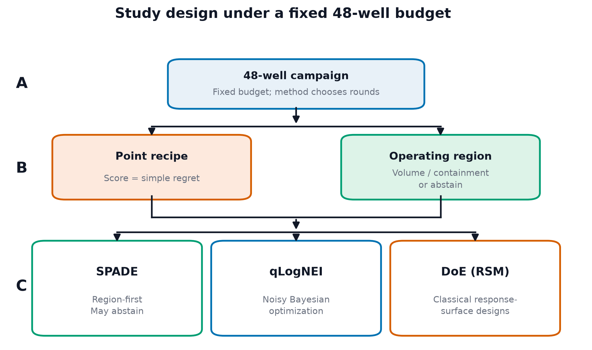
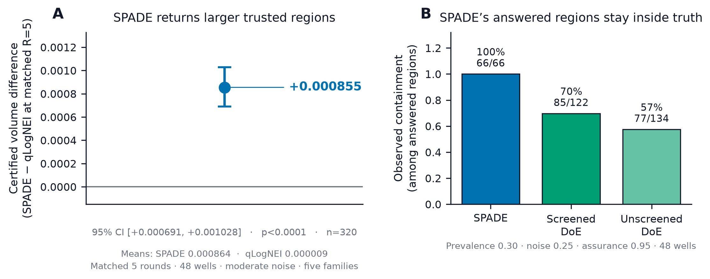
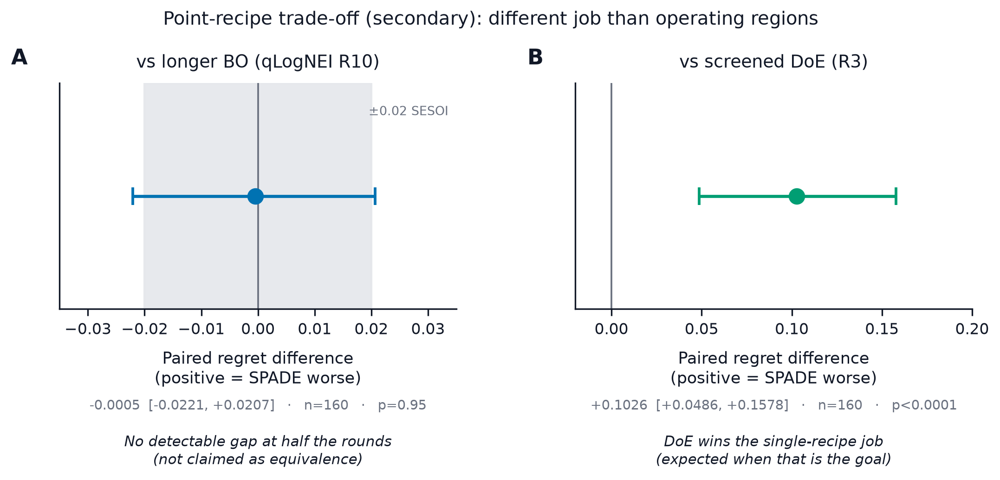
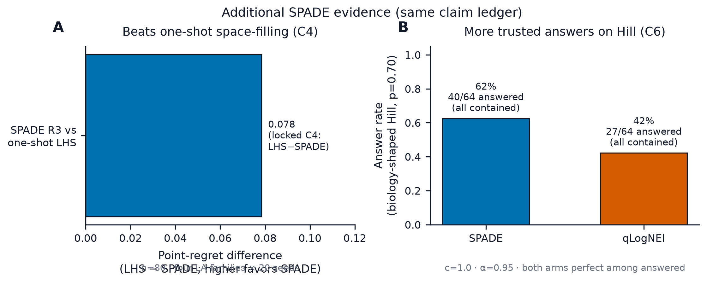

# Operating-region and point-recipe decisions rank experimental designs differently under a fixed 48-well budget: a synthetic SPADE comparison with Bayesian optimization and response-surface design

**Short title:** Fixed-budget operating-region decisions

**Authors:** Alana Wai Han Kwan¹*, Joseph Yung²

**Affiliations:** ¹ Department of Chemical Engineering, Columbia University, New York, New York, United States of America ² Department of Industrial Engineering and Operations Research, Columbia University, New York, New York, United States of America

**Corresponding author:** Alana Wai Han Kwan¹ (11281128alana@gmail.com)

**Author emails:** Alana Wai Han Kwan, 11281128alana@gmail.com; Joseph Yung, josephyung33@gmail.com

## Competing interests

The authors have declared that no competing interests exist. No commercial entity funded, owned, or directed this analysis. Retrospective in-house assay files used only for supporting uncertainty diagnostics (Supporting Information) were academic research materials and conferred no financial interest.

## Funding

This work received no specific grant from any funding agency in the public, commercial, or not-for-profit sectors. Computational resources were provided by the authors’ academic affiliations.

## Ethics statement

All primary experiments were computer simulations on synthetic response surfaces. No new human participants, animals, cell lines, or biological specimens were generated for this study, and no institutional review board approval was required for the synthetic benchmark. Retrospective in-house assay files used in supporting diagnostics were previously collected academic materials; no new human or animal sampling was performed for this manuscript.

## Abstract

With a fixed number of experimental wells, a lab may want either one best recipe or a set of settings it can trust to stay above a quality threshold. Those goals are different, so the “best” method can change with the goal. We tested SPADE (Synthetic Posterior Abstaining Design for Excursions)—software that tries to return a conservative operating region and may say “not sure” instead of guessing—against noisy Bayesian optimization (qLogNEI) and classical response-surface DoE on synthetic test problems, all with the same 48-well budget. Conclusion: on this benchmark, choose SPADE when you need a trusted region; choose DoE (or similar) when you only need one recipe. Against qLogNEI at five matched rounds, SPADE returned a usable region much more often (116 of 320 comparisons versus 6 of 320). When a method returned nothing, we counted volume as zero. Average region size was therefore higher for SPADE (0.000864 versus 0.0000094 on a 2,000-point map; difference +0.000855). A 95% confidence interval for that average difference ran from +0.000691 to +0.001028 and did not include zero; a randomization check gave p < 0.000125. “Certified volume” here means the share of that map inside the region the method is willing to call acceptable. Among the rare times qLogNEI did answer, its regions were still smaller on average (0.00050 versus 0.00238 for SPADE). Against DoE, SPADE’s answered regions always matched truth (66/66), while DoE answered more often but was often wrong. DoE did win at finding a single best recipe. Five-round SPADE looked similar to longer ten-round qLogNEI on recipe quality, without proving they are equivalent. These findings are for synthetic surfaces and moderate noise only—not wet-lab proof.
## Introduction

Cell-culture media, extracellular-matrix composition, and bioprocess parameters are chosen jointly, so even a modest factor grid can exceed a practical assay budget. Classical response-surface methodology provides screening, sequential movement, and low-order local modelling [1–3]. Bayesian optimization (BO) instead fits a probabilistic surrogate and allocates observations to improve an objective [4–6]. Both approaches are used in biological and bioprocess development [7–12].

The decision made after sampling matters as much as the sampling rule. One laboratory may need a single carry-forward recipe, appropriately scored by point regret. Another may need an operating region: a set of compositions expected to exceed a specification, with an explicit option to abstain when the evidence is insufficient. A method can find a strong point while learning little about the surrounding region, or map a region without finding the global optimum. Point regret, map error, answer rate, empirical truth containment, and certified volume are therefore distinct estimands.

Region estimation is not new. Gaussian-process (GP) level-set classification and boundary-focused batch sampling are established [13], as are conservative excursion-set estimators based on posterior inclusion [14] and methods such as TruVaR that connect optimization with level-set learning [15]. qLogNEI is a modern noisy expected-improvement method [16]. Proper scoring separates probabilistic forecasts from downstream decisions [17], while BoTorch supplies established computational components [18]. Recent synthetic batch-BO work further shows that noise and geometry can alter rankings [19], and good simulation-study practice requires explicit estimands and data-generating scope [20].

SPADE (Synthetic Posterior Abstaining Design for Excursions) is an assay-oriented architecture built from these established ingredients, not a new excursion-set theory. It combines a space-filling opening, adaptive high-response sampling, a common posterior conservative-set estimator that can also score comparator observations, and abstention. Its acquisition should not be described as successfully threshold-targeted: a registered target-aligned variant failed its adoption gate. The scientific question is instead whether this architecture improves the tested regional decision while honestly retaining point-optimization trade-offs.

We report linked findings labeled C1–C6 and S1–S3. C3 asks whether matched five-round SPADE returns greater certified volume than qLogNEI. C1 asks whether five-round SPADE differs detectably from ten-round qLogNEI on point regret. C2 compares regional containment and point regret with one screened and one unscreened response-surface DoE pipeline. C4 asks whether three-round SPADE improves point regret relative to one-shot Latin hypercube sampling. C5 and C6 examine family/prevalence scope. Supporting analyses S2 and S3 diagnose real-data posterior collapse and assay-specific calibration (reported as supporting information summaries). Finally, S1, a real-noise ceiling, and a later development gate that selected no protocol define where positive interpretation must stop.

## Materials and Methods

### Study design and evidence roles

The confirmatory DC and LC programs used five synthetic response families—Ackley, Hartmann6, biphasic Hill, Levy, and Rosenbrock—32 deterministic seeds per family, six normalized factors, 48 measured wells, and relative observation noise 0.25. TAU used 64 seeds per family. Hill varied by registered instance; other evaluators used fixed landscapes with design and noise varying by seed. Known latent truth was used only for synthetic scoring. These landscapes are structural test functions, not fits to endothelial-cell measurements.

For latent normalized response $f(x)$ on $x\in[0,1]^6$, the threshold $\tau$ was the instance-specific truth quantile that produced the registered target prevalence $p$. The acceptable region was $\Gamma_\tau=\{x:f(x)\geq\tau\}$. Thresholds were computed on a 20,000-point Sobol truth grid with seed 0. A 2,000-point Sobol certificate-candidate and scoring subset at the same seed was used for posterior-region construction and truth-containment scoring. Each certificate used 4,096 joint posterior draws and 64 nested Vorob'ev levels.

DC supplied the one-process point comparison (C1) and DoE comparison (C2). LC supplied the leave-one-family-out matched-round comparison (C3). TAU supplied the prevalence and margin-to-noise analyses (C5/C6). TT tested the proposed targeting mechanism (S1). Retrospective in-house and published Hall–Ogle data supplied supporting uncertainty diagnostics (S2/S3), not prospective validation.

All synthetic arms used 48 wells. SPADE at three rounds used an opening of 32 followed by two batches of 8; SPADE at five rounds used an opening of 16 followed by four batches of 8. Matched qLogNEI R3 and R5 used the same respective allocations. qLogNEI R10 used a 14-point Sobol opening, eight batches of four, and a final batch of two. The screened DoE R3 workflow used a 20-run six-factor screen, a 27-run four-factor face-centred response-surface design, and one confirmation well. The registered unscreened comparator omitted screening, used one 47-run full-dimensional face-centred central-composite design, and measured one confirmation well; it retained the protocol's DoE R3 comparator label even though its executed measurements comprise design and confirmation stages. Equal wells therefore did not mean equal sequential rounds.

**Fig 1. Study design under a fixed 48-well budget.** (A) Every arm uses the same 48-well campaign; the method chooses round structure and the terminal return. (B) The campaign is scored as a point-recipe decision (simple regret) and/or an operating-region decision (certified volume, containment, or abstention). (C) Comparators: SPADE (region-first), qLogNEI (noisy Bayesian optimization), and DoE response-surface pipelines. This schematic defines the benchmark and contains no performance result.

### SPADE architecture and comparators

Observations followed $y(x)=f(x)(1+\epsilon)+\eta$, with $\epsilon\sim\mathcal N(0,\sigma_{\mathrm{rel}}^2)$, $\sigma_{\mathrm{rel}}=0.25$, and $\eta\sim\mathcal N(0,0.01^2)$. SPADE and qLogNEI supplied the GP with the raw-unit plug-in variance $\max(y^2\sigma_{\mathrm{rel}}^2+0.01^2,0.01^2)$, computed from the observed value rather than latent truth. The DoE adapters lacked per-well variances and used their registered arm-constant plug-in $\sigma_{\mathrm{rel}}^2\overline{|y|}^2$.

The common outcome model was a fixed-noise `SingleTaskGP` with explicit unit-box input normalization, standardized outcomes, a fitted constant mean, and a scaled Matérn-5/2 kernel with automatic relevance determination and a dimension-scaled length-scale prior. Hyperparameters were fitted by exact marginal likelihood. SPADE began with the Sobol space-filling opening, refitted after every later batch, and used its registered conservative-set straddle implementation for adaptive high-response sampling. The implemented historical acquisition is retained because the target-aligned replacement did not demonstrate improvement or earn adoption and worsened regret; no claim here attributes the results to successful threshold targeting.

For posterior draw $b$, the finite-grid excursion set was $\Gamma_\tau^{(b)}=\{x:f^{(b)}(x)\geq\tau\}$ on the 2,000-point scoring grid. The 4,096 draws formed a coverage function and 64 nested Vorob'ev candidates. For each inflation $c\in\{1.0,1.5,2.0,3.0\}$, the common downstream estimator returned the largest scanned candidate whose same-draw Monte Carlo posterior joint containment reached alpha=0.95. “Largest” means largest in that finite nested family, not a global optimum over all continuous subsets. If no non-empty candidate passed, the procedure abstained.

qLogNEI used the same GP outcome model and well budget while allocating batches by noisy expected improvement. Its observations were passed through the common posterior conservative-set estimator; regional certificates are therefore common post-processing, not an intrinsic qLogNEI output. Screened DoE used a 20-run six-factor screen, a 27-run face-centred response-surface design in four factors, and one confirmation well. The unscreened arm retained the low-order workflow without screening. These implementations do not represent all BO or classical-design methods.

### Outcomes and calibration

In plain language we score two end-of-run decisions. A point recipe is “pick one setting”; we measure how far that pick is from the true best (simple regret; lower is better). An operating region is “which settings are still good enough?”; we measure how large a conservative region the method returns (certified volume), whether that region sits inside truth when it answers (containment), and how often it refuses to answer (abstention).

The terminal point recommendation was the visited condition with the largest observed response; it was then scored by latent truth. Because each family was normalized to optimum one, simple regret was $1-f(\widehat x)$. This prevents crediting a method for visiting a strong point that its noisy observations did not identify.

A regional answered outcome was a non-empty returned conservative set. contained recorded whether an answered set was a subset of the known synthetic acceptable region; answer rate was answered divided by eligible cells, conditional empirical containment was contained divided by answered, and certified volume was the returned fraction of the 2,000-point scoring grid. Abstention was not counted as containment. The registered cross-cell gate required a one-sided 95% Clopper–Pearson lower bound of at least 0.90 among answered cells and answer rate of at least 0.05.

C3 selected the smallest posterior inflation c that passed the registered rule on four families and evaluated volume on the held-out fifth family. It pooled prevalence 0.30 and 0.10, yielding five families x 32 seeds x two prevalences = 320 dependent family-seed-prevalence cells. C2 used a weaker procedure: SPADE selected c=1 within the DC cells themselves. Neither DoE arm passed at any tested inflation, so its reported counts are fallback diagnostics at baseline c=1. C2 is within-sample and not transportable; it is not the held-out-family calibration used for C3.

Earlier prospective map scoring used a fixed 0.50 cutoff. Its archived certificate count is a posterior self-consistency check, not empirical containment against the oracle. The retrospective terminal-rule comparison also used a common GP for all arms: a 20,000-point screen, twenty restarts and 4,096 raw starts. Earlier quadratic response-surface diagnostics are separate and are not substituted for that recommender.

### Statistical analysis

Contrasts were paired by family and seed or by family, seed, and prevalence. Frozen analysers used 8,000 ordinary nonparametric resamples of flat contrast rows, percentile intervals, and two-sided bootstrap tail-area proportions relative to zero. With 8,000 resamples the finest non-zero two-sided tail probability that can be reported is 1/8,000 = 0.000125; we therefore write p < 0.000125 rather than a finer bound. Point regret used a registered smallest effect of interest of ±0.02. No smallest effect of interest was registered for certified volume; volume contrasts are interpreted as directional evidence for the tested regional decision. The flat-cell bootstrap treats cells as exchangeable. Because rows can share families, landscapes, seeds, prevalences, and campaigns, its intervals are conditional descriptive summaries and may be too narrow under dependence; cells are not independent campaigns. Pooled Clopper–Pearson bounds similarly assume an ordinary binomial model.

The C5 Spearman coefficient is descriptive over 25 nested, nonexchangeable family-prevalence cells; no naive independence-based p-value is interpreted.

### Reproducibility

Analyses used Python 3.11 with PyTorch, GPyTorch, BoTorch, NumPy, SciPy, pandas, and scikit-learn. Frozen inputs, producing commands, exact estimates, guard coverage, and limitations are indexed in `manuscript/CLAIMS-AND-SOURCES.md`. The active PLOS source remains in this repository. Consolidated C1–C6/S1 provenance is pinned to repository commit `ec14bc7`; the ledger gives portable `git show` and detached-worktree instructions. No frozen result was changed for this rewrite.

### Artificial intelligence assistance

OpenAI Codex (GPT-based coding assistant) assisted with manuscript drafting and revision, source-code inspection, figure-generation scripts, and document formatting. The authors reviewed and edited all AI-assisted text and take responsibility for the scientific interpretation, references, code, figures, and reported results. No generative AI system was used to create experimental data.

## Results

### Matched five-round SPADE returned greater certified volume

Table 1 lists the settings for this comparison (C3). In plain terms: after the same number of feedback rounds and the same 48 wells, does SPADE return a trustworthy operating region more usefully than qLogNEI?

Yes—mainly because SPADE answers more often. Under leave-one-family-out calibration, SPADE returned a non-empty region in 116 of 320 paired contrasts (36%), while qLogNEI did so in only 6 of 320 (2%). We score “no region” as volume zero. Average certified volume across all contrasts was therefore 0.000864 for SPADE versus 0.0000094 for qLogNEI (about 1.73 versus 0.019 points on the 2,000-point scoring grid). The average difference was +0.000855. A 95% confidence interval for that average ran from +0.000691 to +0.001028 (entirely above zero); a bootstrap check gave p < 0.000125 (n = 320 paired contrasts).

So the headline is mostly an answer-rate result: qLogNEI almost never certifies anything under these rules. When both methods did answer, SPADE’s regions were still larger on average (0.00238 versus 0.00050, i.e., about one grid point for qLogNEI). Certified volume means the fraction of the scoring grid inside the returned region. We did not pre-register a “how big a volume win counts” threshold, so we treat this as directional support for the region decision—not a claim that SPADE is always best. A similar three-round volume claim was withdrawn after more seeds were run.

**Fig 2. SPADE’s regional advantage versus qLogNEI and DoE.** (A) How much larger SPADE’s average certified volume is than qLogNEI’s at matched five rounds (+0.000855; 95% CI +0.000691 to +0.001028; p < 0.000125; n = 320), counting “no region” as zero volume. SPADE returned a region in 116/320 comparisons; qLogNEI in 6/320. (B) When each method did return a region versus DoE at prevalence 0.30: SPADE 66/66 correct; screened DoE 85/122; unscreened DoE 77/134. Counting every campaign (including no-answers): 66/160, 85/160, and 77/160 correct. (A) Certified-volume difference at matched five rounds (+0.000855, 95% CI +0.000691 to +0.001028, p < 0.000125; n = 320), with abstentions scored as zero. SPADE answered 116/320 contrasts versus 6/320 for qLogNEI. (B) Versus DoE at prevalence 0.30: containment among answered regions (SPADE 66/66; screened DoE 85/122; unscreened DoE 77/134). Unconditional contained counts are 66/160, 85/160, and 77/160. (A) Certified-volume difference (SPADE minus qLogNEI) at matched five rounds: +0.000855 (95% CI [+0.000691, +0.001028], p < 0.000125, n = 320). Absolute means were 0.000864 (SPADE) and 0.000009 (qLogNEI) on the 2,000-point grid (one point = 0.0005 of volume). (B) Observed truth containment among answered regions at prevalence 0.30: SPADE 66/66 versus screened DoE 85/122 and unscreened DoE 77/134. Unconditional contained counts are 66/160, 85/160, and 77/160.

**Table 1. C3 matched-round regional comparison.**

| Scope | Prevalence | Noise | Assurance | Calibration | Wells; rounds | Seeds and denominator | Result |
|---|---:|---:|---:|---|---|---|---|
| Five synthetic families; SPADE vs qLogNEI | 0.30 and 0.10 | 0.25 | 0.95 | LOFO inflation over c={1,1.5,2,3} | 48; R5 vs R5 | 32/family; 320 dependent family-seed-prevalence cells | Volume difference +0.000855 |

### Point regret showed no detectable difference from longer qLogNEI

Here the question is recipe quality, not regions (comparison C1). Both methods used 48 wells; SPADE used five rounds and qLogNEI used ten. Average simple regret differed by −0.0005 (SPADE minus qLogNEI), with a 95% confidence interval from −0.0221 to +0.0207 (p = 0.96; n = 160 family–seed pairs). In words: we see no clear winner on the single best recipe, and the interval is wide enough that we also cannot claim the two methods are practically equivalent within the pre-set ±0.02 margin. Calendar time and dollar cost were not measured.

**Fig 3. Point-recipe trade-off (secondary to the region decision). (A) SPADE at five rounds minus qLogNEI at ten rounds on simple regret: no detectable difference (-0.0005, 95% CI [-0.0221, +0.0207], n = 160); not claimed as equivalence. (B) SPADE at five rounds minus screened DoE at three rounds: DoE finds the better single recipe (+0.1026, 95% CI [+0.0486, +0.1578]); expected when the goal is one point rather than a region.**

### DoE found a better point recipe but weaker regional containment

Against classical DoE the trade-off is clear (Table 2). On finding one best recipe, screened DoE won: SPADE’s regret was worse by +0.1026 (95% CI +0.0486 to +0.1578, p = 0.0003; n = 160). DoE used three rounds; SPADE used five.

On trustworthy regions, the ranking flips. At the main region setting (30% of the space truly “good,” moderate noise), SPADE returned a region in 66 of 160 campaigns and every one of those 66 matched truth (100%; statistical lower bound 0.9556). SPADE used a within-sample inflation choice of c = 1. Neither DoE arm passed at any tested inflation, so DoE counts are fallback diagnostics at baseline c = 1: screened DoE answered 122/160 with 85 contained (0.6967 among answers); unscreened DoE answered 134/160 with 77 contained (0.5746). SPADE’s inflation was selected on these cells while the DoE arms had no passing inflation to select, so the comparison is not calibration-matched; it reports what each pipeline returns under its own best available setting. Per eligible campaign, contained counts were 66/160 for SPADE versus 85/160 (screened DoE) and 77/160 (unscreened DoE). DoE therefore returns more correct regions on an unconditional count only because it answers more often, including incorrect certificates (37 wrong among screened answers; 57 wrong among unscreened answers). SPADE abstains more often (94/160). Under an asymmetric loss in which a false certified region is treated as a manufacturing failure and abstention is treated as a request for more data, the conditional 66/66 record is the primary regional score and the unconditional gap does not overturn it. These within-sample descriptive results do not condemn DoE as a class or establish transportable coverage.

**Table 2. C2 regional answers and point trade-off.**

| Arm | Scope | Prevalence; noise; assurance | Wells; rounds; seeds | Inflation rule | Answered | Contained among answers | Contained among eligible |
|---|---|---|---|---|---:|---:|---:|
| SPADE | Five families | 0.30; 0.25; 0.95 | 48; R5; 32/family | Within-sample selected c=1 | 66/160 | 66/66 | 66/160 |
| Screened DoE | Five families | 0.30; 0.25; 0.95 | 48; R3; 32/family | No passing c; baseline c=1 fallback | 122/160 | 85/122 | 85/160 |
| Unscreened DoE | Five families | 0.30; 0.25; 0.95 | 48; R2* (protocol label R3); 32/family | No passing c; baseline c=1 fallback | 134/160 | 77/134 | 77/160 |

\*Unscreened DoE executes a design stage plus one confirmation well (two measurement stages) but retains the protocol’s “R3” comparator label.

**Fig 4. Extra SPADE checks (C4 and C6).** (A) SPADE beats one-shot Latin hypercube sampling on recipe quality at three rounds (advantage +0.0783). Sample size is n = 80 (four families × 20 seeds), not n = 160, by protocol. (B) On a biology-shaped Hill test at prevalence 0.70, SPADE answered more often than qLogNEI (40/64 versus 27/64); every answered region for both methods was correct. (A) Point-regret difference LHS minus SPADE at three rounds (+0.0783; higher favors SPADE). n = 80 because C4 uses four Latin-hypercube families × 20 shared seeds (Hill and seeds 20–31 excluded by protocol), unlike the five-family n = 160 contrasts elsewhere. (B) On biology-shaped Hill at prevalence 0.70, SPADE answered 40/64 versus 27/64 for qLogNEI; both contained truth in every answered cell (descriptive; C6). (A) Point-regret advantage of three-round SPADE over one-shot Latin hypercube sampling (LHS minus SPADE = +0.0783; n = 80; locked C4 mean). Higher values favor SPADE. (B) On the biology-shaped Hill family at prevalence 0.70, SPADE answered 40/64 regions versus 27/64 for qLogNEI; both arms contained truth in every answered cell (descriptive counts; C6).

### Certifiability depended on family, prevalence, and margin-to-noise

Across five families and prevalences 0.70, 0.50, 0.30, 0.20, and 0.10, SPADE answer rate at c=1, alpha=0.95, 48 wells, R5, relative noise 0.25, and 64 seeds per family was descriptively associated with mean seed-specific true margin-to-noise (Spearman rho = 0.988; 25 nested family-prevalence cells). The diagnostic uses latent truth and is explanatory, not available prospectively. Shared families and ordered prevalences make the cells dependent and nonexchangeable.

For the biology-shaped but synthetic Hill family at prevalence 0.70, under those same settings, SPADE answered 40/64 and contained truth in 40/40 (ordinary-binomial lower bound 0.9278). qLogNEI answered 27/64 and contained 27/27; its limitation was the answer count required by the registered gate, not failure to return contained regions.

### Supporting real-data diagnostics (summarized; full rows in Supporting Information)

Treating the fitted GP mean as fixed had little effect in synthetic diagnostics: mean-marginalised posterior width increased by 1.004x–1.011x. The same correction increased mean posterior marginal SD approximately 484x for the in-house candidate dataset and 297x for published Hall–Ogle data. Observation-prediction LOO inflation was assay-specific (c=0.712 in-house and c=0.526 published). These S2/S3 values are retrospective, stdout-reproduced support without structured numerical guards. LOO prediction does not identify latent-function uncertainty, and the in-house CD31 gates remain awaiting human confirmation.

### Failed targeting, the real-noise ceiling, and the unopened confirmation store

The target-aligned acquisition did not earn adoption. Relative to committed SPADE, its certified-volume change was +0.000425 (95% CI [-0.000022, +0.000875]) and its regret was worse by +0.0301 (95% CI [+0.0169, +0.0450], p < 0.000125). Family effects cancelled. This failure is why SPADE's value is described architecturally rather than as a successful targeting mechanism.

At measured real-assay relative noise 0.68, no tested arm certified. Replication and independent noise identification are therefore prerequisites for prospective use at that noise level.

A later future-response development grid evaluated nine candidate protocols on five families. Table 3 reports its preserved ranges; every candidate missed the registered containment floor on at least one family. The selector returned no protocol, no post-hoc power calculation was authorized, and the held-out confirmation records remained frozen and unopened. No confirmation evidence was released.

**Table 3. Joint-protocol development ranges across nine candidates.**

| Family | Answer count range | Empirical containment range |
|---|---:|---:|
| Hill | 49–50 | 0.140–0.490 |
| Ackley | 50 | 0.320–0.820 |
| Hartmann6 | 50 | 0.440–0.940 |
| Levy | 47–49 | 0.213–0.333 |
| Rosenbrock | 47–50 | 0.061–0.320 |

## Discussion

The primary conclusion is decision-specific. At five matched rounds, SPADE produced greater certified volume than qLogNEI under registered LOFO calibration. In the DC comparison its answered regions also had stronger observed truth containment than the tested DoE pipelines. Those findings support SPADE when the requested deliverable is a conservative operating region and abstention is acceptable.

They do not support a universal ranking. The qLogNEI point comparison showed no detectable difference and did not establish equivalence. Screened DoE found a substantially better point recipe in fewer rounds. A laboratory requiring one recipe may rationally prefer a point optimizer; a laboratory requiring a region faces a different loss function.

The contribution is integration and evidence, not theoretical priority. GP level-set learning, Vorob'ev summaries, simultaneous posterior inclusion, and conservative excursion sets are established. SPADE adapts them to a fixed-well assay architecture, uses common regional post-processing across comparator observations, and permits an empty answer. The failed target-alignment experiment prevents attributing the observed regional result to successful threshold targeting.

### Scope and limitations

All comparative landscapes were synthetic, the domain was evaluated on finite grids, and headline noise was 0.25. Families, seeds, target prevalences, kernels, acquisition implementations, and one 48-well budget bound the result. The tested DoE is one low-order response-surface pipeline and qLogNEI is one BO acquisition.

Inference is conditional on the frozen benchmark. The flat-cell bootstrap may be too narrow because repeated family-seed-prevalence cells are dependent. Pooled binomial bounds do not become cluster-aware merely because they are exact under an ordinary Bernoulli model. C2 calibration is within-sample; only C3 holds a family out during inflation selection. Neither procedure supplies distribution-free or regulatory coverage.

The real-data analyses are retrospective diagnostics. They do not establish recipe equivalence, manufacturing qualification, regulatory validation, or prospective wet-lab performance. The relative-noise ceiling, unsigned in-house gates, missing replicate-tube noise identification, the joint-protocol development outcome that selected no protocol, and the unopened confirmation store preclude such claims.

### Relationship to published and retained evidence

Table 4 situates the contribution. Physical and biological optimization studies provide wet-lab relevance but usually answer different budget and decision questions. Methodological papers supply the level-set and conservative-set foundations. The present simulation offers known truth but no biological validation.

**Table 4. Selected precedents and scope.**

| Evidence | Decision or method | Relationship to this study |
|---|---|---|
| Hall, Lin, and Ogle [7] | Experimental-design study of extracellular matrix | Published assay-shape support; not a SPADE campaign |
| Rummukainen et al. [8] | Physical DoE and adaptive optimization | Wet-process evidence with a different budget |
| Lapierre et al. [9] | Multicycle BO and two-step DoE | Biological growth outcome |
| Gotovos et al. [13] | Level-set classification | Established level-set precedent |
| Azzimonti et al. [14] | Conservative excursion sets | Close estimator antecedent |
| Bogunovic et al. [15] | TruVaR | Optimization/level-set connection |
| Present study | Point and conservative-region decisions | Fixed-well synthetic comparison with abstention |

**Table 5. Contribution and novelty boundary.**

| Element | Classification | Present contribution |
|---|---|---|
| GP excursion sets, boundary learning, Vorob'ev candidates | Established | Integrated, not claimed as new theory |
| qLogNEI and response-surface DoE | Established comparator ingredients | Implemented as specific fixed-budget pipelines |
| Per-well variances, round schedules, empty answer | Assay-oriented adaptation | Operational SPADE architecture |
| Common conservative-region estimator | Comparative-design choice | Separates observations from regional post-processing |
| Regret, volume, answers, and truth containment | Empirical evidence | Bounded to named synthetic settings |

## Conclusions

On this synthetic 48-well benchmark, SPADE is the better tool when the job is a trusted operating region with honest abstention: it returns a region far more often than qLogNEI under the same conservative rules, and when it answers against DoE it stays inside truth. It is not the better tool when the job is only one carry-forward recipe—DoE wins that comparison. Five-round SPADE looks similar to longer qLogNEI on recipe quality without proving equivalence. These computer results do not replace wet-lab validation or regulatory qualification.

## Data availability statement

Primary result files, analysis scripts, protocols, and supporting tables are available in the project repository at https://github.com/akwnn/nutrigene-ai-bo-ipsec (commit ec14bc7 anchors the audited publication package; the submission branch carries the PLOS manuscript rebuilds). Original software is released under the MIT License; original research materials are released under CC BY 4.0 (see LICENSE and LICENSE-CONTENT.md). Audited claim sources are indexed in publication/manuscript/CLAIMS-AND-SOURCES.md. A DOI-bearing Zenodo (or equivalent) archival snapshot of the submission package will be minted at or before journal submission and will replace this placeholder (see manuscript/ZENODO-DEPOSIT.md). Until that DOI is issued, the GitHub repository is the working source of the materials described here.

## Author contributions

**Alana Wai Han Kwan:** Conceptualization; Formal analysis; Investigation; Methodology; Project administration; Validation; Visualization; Writing – original draft; Writing – review & editing.

**Joseph Yung:** Conceptualization; Data curation; Formal analysis; Investigation; Methodology; Software; Validation; Writing – review & editing.

Roles follow the CRediT taxonomy.

## Acknowledgments

We thank the Obermeyer Research Group at Columbia University for research context on multicomponent formulation design. Computational experiments used synthetic landscapes; no wet-lab samples were generated for this study.

## References

1. Box GEP, Wilson KB. On the experimental attainment of optimum conditions. J R Stat Soc Series B Stat Methodol. 1951;13:1–38. doi:10.1111/j.2517-6161.1951.tb00067.x
2. Box GEP, Draper NR. Empirical model-building and response surfaces. New York: Wiley; 1987.
3. Myers RH, Montgomery DC, Anderson-Cook CM. Response surface methodology: Process and product optimization using designed experiments. 4th ed. Hoboken: Wiley; 2016.
4. Močkus J. On Bayesian methods for seeking the extremum. In: Marchuk GI, editor. Optimization techniques IFIP Technical Conference. Berlin: Springer; 1975. p. 400–404. doi:10.1007/3-540-07165-2_55
5. Jones DR, Schonlau M, Welch WJ. Efficient global optimization of expensive black-box functions. J Glob Optim. 1998;13:455–492. doi:10.1023/A:1008306431147
6. Frazier PI. A tutorial on Bayesian optimization. arXiv:1807.02811 [Preprint]. 2018 [cited 2026 Aug 26]. Available from: https://arxiv.org/abs/1807.02811
7. Hall ML, Lin W-H, Ogle BM. Optimizing extracellular matrix for endothelial differentiation using a design of experiments approach. Sci Rep. 2025;15:24479. doi:10.1038/s41598-025-09256-9
8. Rummukainen H, Hörhammer H, Kuusela P, Kilpi J, Sirviö J, Mäkelä M. Traditional or adaptive design of experiments? A pilot-scale comparison on wood delignification. Heliyon. 2024;10:e24484. doi:10.1016/j.heliyon.2024.e24484
9. Lapierre F, Mattaliano P, Raith D, Castillo-Cota M, Bermeitinger J, Huber R. Multi-cycle high-throughput growth media optimization using batch Bayesian optimization. J Chem Technol Biotechnol. 2025;100:1571–1583. doi:10.1002/jctb.7860
10. Ndahiro N, Ma E, Bertalan T, Donohue M, Kevrekidis Y, Betenbaugh M. Integration of Bayesian optimization and solution thermodynamics to optimize media design for mammalian biomanufacturing. iScience. 2025;28:112944. doi:10.1016/j.isci.2025.112944
11. Narayanan H, Hinckley JA, Barry R, Dang B, Wolffe LA, Atari A, Tseng Y-Y, Love JC. Accelerating cell culture media development using Bayesian optimization-based iterative experimental design. Nat Commun. 2025;16:6055. doi:10.1038/s41467-025-61113-5
12. Gisperg F, Klausser R, Elshazly M, Kopp J, Přáda Brichtová E, Spadiut O. Bayesian optimization in bioprocess engineering—Where do we stand today? Biotechnol Bioeng. 2025;122:1313–1325. doi:10.1002/bit.28960
13. Gotovos A, Casati N, Hitz G, Krause A. Active learning for level set estimation. Proceedings of the Twenty-Third International Joint Conference on Artificial Intelligence. 2013. Available from: https://people.csail.mit.edu/alkisg/files/gotovos13active.pdf
14. Azzimonti D, Ginsbourger D, Chevalier C, Bect J, Richet Y. Adaptive design of experiments for conservative estimation of excursion sets. Technometrics. 2021;63:13–26. doi:10.1080/00401706.2019.1693427
15. Bogunovic I, Scarlett J, Krause A, Cevher V. Truncated variance reduction: A unified approach to Bayesian optimization and level-set estimation. Advances in Neural Information Processing Systems. 2016;29. Available from: https://papers.neurips.cc/paper_files/paper/2016/hash/ce78d1da254c0843eb23951ae077ff5f-Abstract.html
16. Ament S, Daulton S, Eriksson D, Balandat M, Bakshy E. Unexpected improvements to expected improvement for Bayesian optimization. Advances in Neural Information Processing Systems. 2023;36. Available from: https://proceedings.neurips.cc/paper_files/paper/2023/hash/419f72cbd568ad62183f8132a3605a2a-Abstract-Conference.html
17. Gneiting T, Raftery AE. Strictly proper scoring rules, prediction, and estimation. J Am Stat Assoc. 2007;102:359–378. doi:10.1198/016214506000001437
18. Balandat M, Karrer B, Jiang D, Daulton S, Letham B, Wilson AG, et al. BoTorch: A framework for efficient Monte-Carlo Bayesian optimization. Advances in Neural Information Processing Systems. 2020;33. Available from: https://proceedings.neurips.cc/paper/2020/hash/f5b1b89d98b7286673128a5fb112cb9a-Abstract.html
19. Mia I, Tiihonen A, Ernst A, Srivastava A, Buonassisi T, Vandenberghe W, et al. Multi-variable batch Bayesian optimization in materials research: Synthetic data analysis of noise sensitivity and problem landscape effects. J Mater Res. 2026;41:927–948. doi:10.1557/s43578-026-01803-y
20. Morris TP, White IR, Crowther MJ. Using simulation studies to evaluate statistical methods. Stat Med. 2019;38:2074–2102. doi:10.1002/sim.8086

## Supporting information captions

Main text Figures 1–4 follow the region-first presentation: method selection (Fig 1), SPADE’s certified-volume and containment advantage (Fig 2), the secondary point-recipe trade-off (Fig 3), and additional locked SPADE evidence C4/C6 (Fig 4). Numeric sources are in `publication/manuscript/CLAIMS-AND-SOURCES.md` and `research/results/comparisons/`.

**S1 Table.** Optional archive: historical Rule A versus Rule P terminal-rule rows.
Motivation only; not a current C1 claim.

**S2 Table.** Optional archive: historical two-round map-error contrasts.
Motivation only; not a current C3 claim.

**S3 Table.** Optional archive: older posterior self-consistency checks.
These do not replace empirical containment or the C3 certified-volume result.
